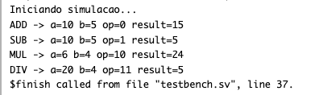
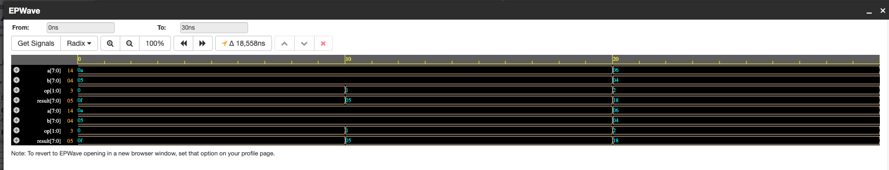

# Projeto calc

result = operação(a, b, op)

## Operações

- `2'b00`: soma
- `2'b01`: subtração
- `2'b10`: multiplicação
- `2'b11`: divisão

## Compilação

- usando o eda playground

- Config
  - Language: SystemVerilog
  - Simulator: Synopsys VCS
  - Open EPWave after run

## dados atraves do testbench

## caso 1 op=00(soma)

a = 10 / b = 5 = 10 + 5 = 15 -> 0x0F
result = 0F

## caso 2 op=01(subtracao)

a = 10 / b = 5 = 10 - 5 = 5 -> 0x05
result = 5

## caso 3 op=10(multiplicacao)

a = 6 / b = 4 = 6 \* 4 = 24 -> 0x18
result = 18

## caso 4 op=11(divisao)

a = 20 / b = 4 = 20 / 4 = 5 -> 0x05
result = 05

# Screenshots

