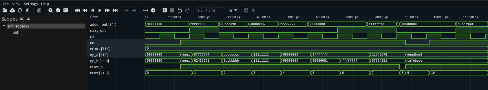

# Somador 32 bits (adder32)

## 1. Sobre o circuito

Pense numa calculadora de bolso que soma dois números. Você digita o primeiro número, digita o segundo, aperta igual — e o resultado aparece no visor. Se o resultado for grande demais para caber no visor (por exemplo, ele só tem 8 dígitos mas o resultado tem 9), o visor mostra os 8 últimos dígitos e acende uma luz de "overflow" ou "carry".

O **somador de 32 bits** faz exatamente isso, só que com números binários de 32 bits:

- Recebe dois números de 32 bits (`op_a` e `op_b`).
- Soma os dois e produz o resultado também em 32 bits (`adder_out`).
- Se o resultado não couber em 32 bits (ultrapassar o valor máximo), acende o sinal de carry (`carry_out = 1`).

Com 32 bits é possível representar números de 0 até 4.294.967.295 (mais de 4 bilhões). Se a soma ultrapassar esse valor, o carry_out sinaliza o estouro.

Esse circuito é o componente mais básico de qualquer processador. Toda operação aritmética — seja numa CPU, numa GPU ou num microcontrolador — começa com um somador.

---

## 2. Como funciona?

1. O circuito recebe dois operandos de 32 bits: `op_a` e `op_b`.
2. Internamente, ele usa um registrador de **33 bits** para guardar o resultado. Os 32 bits inferiores são o resultado da soma; o bit 32 (o extra) é o carry — o "dígito que sobrou".
3. A cada borda de subida do clock, se `en=1`, o circuito realiza `op_a + op_b` e armazena em 33 bits.
4. A saída `adder_out` é os 32 bits inferiores do registrador (`adder_reg[31:0]`).
5. A saída `carry_out` é apenas o bit 32 do registrador (`adder_reg[32]`).
6. Reset zera o registrador de 33 bits.

A "mágica" é simples: ao fazer a soma em 33 bits, o resultado nunca transborda — qualquer carry que aconteceria ao somar em 32 bits aparece naturalmente no bit 33.

---

## 3. Os sinais explicados

| Sinal       | Direção | Tamanho | O que significa na prática                                                     |
| ----------- | ------- | ------- | ------------------------------------------------------------------------------ |
| `clk`       | entrada | 1 bit   | Clock do circuito. A cada borda de subida, a soma é calculada.                 |
| `reset_n`   | entrada | 1 bit   | Reset ativo baixo: quando vale 0, zera o resultado imediatamente.              |
| `en`        | entrada | 1 bit   | Enable: quando vale 1, a soma é executada; quando vale 0, o resultado congela. |
| `op_a`      | entrada | 32 bits | Primeiro número a ser somado. Pode ser qualquer valor de 0 a 4.294.967.295.    |
| `op_b`      | entrada | 32 bits | Segundo número a ser somado. Mesmo range que `op_a`.                           |
| `adder_out` | saída   | 32 bits | Os 32 bits inferiores do resultado da soma.                                    |
| `carry_out` | saída   | 1 bit   | Vale 1 se a soma ultrapassou 32 bits (resultado acima de 4.294.967.295).       |

---

## 4. O código RTL linha a linha

```verilog
module adder (
  clk,
  reset_n,
  en,
  op_a,
  op_b,
  adder_out,
  carry_out
);
```

Declaração do módulo `adder` com seus 7 pinos. Note que o nome do módulo é `adder`, não `adder32` — o `32` é apenas convencional para indicar a largura dos operandos.

```verilog
input clk, reset_n;
input en;
input [31:0] op_a;
input [31:0] op_b;
```

Os operandos `op_a` e `op_b` têm 32 bits cada (`[31:0]`). O range vai do bit 31 (mais significativo, o "maior peso") ao bit 0 (menos significativo).

```verilog
output [31:0] adder_out;
output carry_out;
```

A saída principal tem 32 bits. O carry é apenas 1 bit — ou "coube" (0) ou "não coube" (1).

```verilog
reg [32:0] adder_reg;
```

Esta é a linha mais importante do design: `adder_reg` tem **33 bits** (`[32:0]`), não 32. O bit extra (posição 32) vai capturar o carry automaticamente quando a soma de dois números de 32 bits ultrapassar o limite.

```verilog
assign adder_out = adder_reg[31:0];
assign carry_out = adder_reg[32];
```

Estas duas linhas usam `assign` — conexões contínuas, como fios soldados. São equivalentes a dizer:

- "A saída `adder_out` é sempre igual aos 32 bits inferiores de `adder_reg`."
- "A saída `carry_out` é sempre igual ao bit 32 de `adder_reg`."

Não há lógica aqui — são apenas conexões físicas.

```verilog
always @(posedge clk or negedge reset_n) begin
```

Bloco sensível à borda de subida do clock e ao reset assíncrono.

```verilog
    if (!reset_n) begin
        adder_reg <= 33'd0;
    end
```

Reset: o registrador de 33 bits vai para zero. `33'd0` significa "zero em decimal representado com 33 bits". O `<=` é uma atribuição não-bloqueante — o valor é atualizado ao fim do ciclo, sem interferir em outras atribuições simultâneas.

```verilog
    else begin
        if (en) begin
            adder_reg <= op_a + op_b;
        end
    end
```

Quando o enable está ativo, o resultado de `op_a + op_b` é calculado e armazenado em `adder_reg`. O Verilog automaticamente expande a soma para 33 bits quando o destino é um registrador de 33 bits — o carry aparece naturalmente no bit 32.

```verilog
end
endmodule
```

Encerramento do `always` e do módulo.

---

## 5. O testbench explicado

**Etapa 1 — Clock e reset:** Gera clock e aplica reset para iniciar com adder_out=0 e carry=0.

**Etapa 2 — Testa somas com carry:** Usa pares de números grandes que sabidamente ultrapassam 32 bits. Por exemplo, `0xAAAAAAAA + 0xEEEEEEEE` produz um resultado maior que 32 bits — o carry deve ser 1 e o resultado é o valor "truncado" em 32 bits.

**Etapa 3 — Testa soma simples:** `1 + 1 = 2`. Sem carry. Verifica o caso mais básico.

**Etapa 4 — Testa overflow clássico:** `0xFFFFFFFF + 1 = 0` com carry=1. Este é o limite máximo: somar 1 ao maior número de 32 bits "dá a volta" para zero, com carry.

**Etapa 5 — Testa overflow com dois máximos:** `0xFFFFFFFF + 0xFFFFFFFF`. Resultado: `0xFFFFFFFE` com carry=1.

**Etapa 6 — Testa soma sem overflow com valores médios:** `0x11111111 + 0x11111111 = 0x22222222` sem carry.

**Etapa 7 — Testa soma de zeros:** `0 + 0 = 0`. Caso trivial mas necessário.

**Etapa 8 — Reset final:** Confirma que reset zera resultado e carry.

**Etapa 9 — Relatório:** Informa erros encontrados.

---

## 6. Resultado real da simulação

```
  SIMULACAO: Somador 32 bits (adder)
  Funcao: soma op_a + op_b = adder_out + carry_out
  Carry = 1 quando o resultado nao cabe em 32 bits
  Internamente usa 33 bits: carry|resultado[31:0]
  [RESET] adder_out=00000000 carry=0  [OK]
  op_a (hex)   | op_b (hex)   | carry | resultado (hex) | status
  aaaaaaaa     | eeeeeeee     |   1   | 99999998        |    OK
  00000001     | 00000001     |   0   | 00000002        |    OK
  ffffffff     | 00000001     |   1   | 00000000        |    OK  <- carry!
  ffffffff     | ffffffff     |   1   | fffffffe        |    OK  <- carry!
  11111111     | 11111111     |   0   | 22222222        |    OK
  00000000     | 00000000     |   0   | 00000000        |    OK
  reset_n=0 -> carry=0 resultado=00000000  [OK]
  RESULTADO FINAL: TODOS OS TESTES PASSARAM (0 erros)
```

---

## 7. Interpretando os resultados

**`[RESET] adder_out=00000000 carry=0 [OK]`**
O circuito iniciou corretamente com resultado e carry em zero.

**Linha: `aaaaaaaa + eeeeeeee = 99999998, carry=1`**

Vamos verificar esta soma em decimal:

- `0xAAAAAAAA` = 2.863.311.530
- `0xEEEEEEEE` = 4.008.636.142
- Soma = 6.871.947.672

Mas o máximo em 32 bits é 4.294.967.295. A soma ultrapassou esse limite, então:

- carry_out = 1 (houve estouro)
- adder_out = 6.871.947.672 - 4.294.967.296 = 2.576.980.376 = `0x99999998`

O circuito calculou corretamente.

**Linha: `00000001 + 00000001 = 00000002, carry=0`**
Soma simples: 1 + 1 = 2. Sem estouro. O resultado cabe perfeitamente em 32 bits.

**Linha: `ffffffff + 00000001 = 00000000, carry=1`**
Este é o exemplo clássico de overflow! O maior número de 32 bits mais 1 resulta em zero — e o carry sinaliza o estouro. É como quando o hodômetro de um carro passa de 999.999 para 000.000.

**Linha: `ffffffff + ffffffff = fffffffe, carry=1`**
Dois números máximos somados:

- `0xFFFFFFFF + 0xFFFFFFFF = 0x1FFFFFFFE`
- Os 32 bits inferiores são `0xFFFFFFFE`
- O bit 33 (carry) é 1.

**Linha: `11111111 + 11111111 = 22222222, carry=0`**
Soma sem estouro. O resultado `0x22222222` cabe em 32 bits.

**Linha: `00000000 + 00000000 = 00000000, carry=0`**
Zero mais zero é zero. Caso trivial, mas garante que o circuito não produz lixo quando as entradas são zero.

**`reset_n=0 -> carry=0 resultado=00000000 [OK]`**
O reset assíncrono zerou tanto o resultado quanto o carry.

**`RESULTADO FINAL: TODOS OS TESTES PASSARAM (0 erros)`**
Todos os cenários — incluindo os casos de overflow — foram tratados corretamente.

---

## 8. Na prática: para que serve e quando usar?

O somador é o **bloco aritmético mais fundamental** de qualquer sistema digital. Quase toda operação em hardware passa por uma soma em algum momento.

**Onde aparece na vida real:**
- **ALU de processadores:** toda instrução de soma, subtração (soma do complemento de 2), incremento de ponteiro e cálculo de endereço usa um somador. É o coração da CPU.
- **Endereçamento de memória:** `endereço_base + offset` é uma soma. Cada acesso à memória com indexação passa por um somador.
- **Acumuladores em DSP:** filtros digitais (FIR, IIR) acumulam produtos — cada ciclo soma um novo valor ao acumulador. O carry indica quando o sinal saturou.
- **Contadores de hardware:** um contador nada mais é que um somador onde um dos operandos é sempre 1.
- **Cálculo de checksum:** protocolos de comunicação (CRC, soma de verificação) somam bytes de uma mensagem para detectar erros de transmissão.

**Quando escolher um somador de 32 bits:** quando seus operandos chegam a valores acima de 65.535 (limite de 16 bits). Para endereçamento de memória em sistemas com mais de 64KB, você já precisa de 32 bits. O carry é indispensável em qualquer aplicação onde overflow precisa ser detectado em vez de silenciado.

---

## 9. Waveform da Simulação Real

A captura abaixo foi gerada no Surfer após rodar `make wave BLOCK=adder32`:



O sinal mais revelador é o **`carry_out`**: ele fica em 0 na maior parte do tempo, mas sobe para 1 exatamente nos momentos em que a soma não cabe em 32 bits. É como uma luz de alerta piscando só quando há estouro — você consegue ver visualmente quais combinações de entrada causaram o overflow.

O caso mais dramático é quando `op_a=0xFFFFFFFF` e `op_b=0x00000001`: `adder_out` vai para **`0x00000000`** — o contador "deu a volta" — e `carry_out` sobe para 1. O resultado real seria `0x100000000`, que não cabe em 32 bits. O hardware guarda os 32 bits inferiores (zero) e avisa com o carry.

`adder_out` muda a cada ciclo acompanhando os pares de entrada: você consegue identificar cada teste pela sequência de valores — `99999998`, `09bcda98`, `d8888887`, `22222222`, `00000000`, `fffffffe`. Quando `en` cai no final, `adder_out` congela no último valor calculado. `errors` permanece em 0 em todos os 10 testes.
