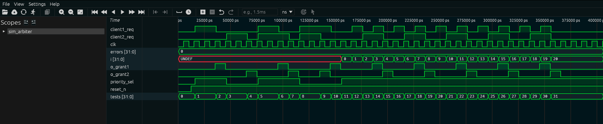

# Árbitro com Prioridade — Guia Didático

## 1. O que é este circuito?

Imagine que você está em um **banco com uma única caixa e dois clientes na fila**. Os dois clientes podem apertar o botão de chamada ao mesmo tempo. O gerente (o árbitro) decide quem vai ser atendido primeiro e, quando o atendimento termina, verifica se o outro ainda está esperando para chamá-lo em seguida.

Tem mais uma regra: o gerente pode configurar uma **prioridade**. Se `priority_sel = 1`, o cliente 1 tem prioridade quando ambos pedem ao mesmo tempo. Se `priority_sel = 0`, o cliente 2 passa na frente.

Este circuito digital, chamado **árbitro** (arbiter), resolve o problema clássico de hardware: dois componentes (mestres de barramento, periféricos, núcleos de processador) querendo usar o mesmo recurso compartilhado ao mesmo tempo. O árbitro garante que apenas um use o recurso por vez — isso se chama **exclusão mútua**.

**Analogia alternativa:** Pense em um **semáforo de cruzamento**. Dois carros chegam ao mesmo tempo pelo cruzamento. O semáforo decide qual passa primeiro, segura o outro, e quando o primeiro terminou, libera o segundo. O árbitro é o semáforo da eletrônica digital.

---

## 2. Como funciona?

O árbitro usa uma **Máquina de Estados Finitos (FSM)** com 3 estados:

- **IDLE (livre):** Ninguém está usando o recurso. O árbitro espera por um pedido.
- **CLINET1 (cliente 1 atendido):** O recurso foi concedido ao cliente 1 (`grant1 = 1`).
- **CLINET2 (cliente 2 atendido):** O recurso foi concedido ao cliente 2 (`grant2 = 1`).

**Fluxo de decisão no estado IDLE:**

- Se `priority_sel = 1` E o cliente 1 pediu → vai para CLINET1
- Senão, se o cliente 2 pediu → vai para CLINET2
- Senão → fica em IDLE

**Fluxo de decisão no estado CLINET1:**

- Se o cliente 2 também está esperando → vai para CLINET2 (fairness: após atender o 1, atende o 2)
- Senão → volta para IDLE

**Fluxo de decisão no estado CLINET2:**

- Se o cliente 1 está esperando → vai para CLINET1
- Senão → volta para IDLE

**Detalhe importante sobre latência:** O árbitro registra os pedidos internamente em `client1_req_d` e `client2_req_d`. Há um delay de 2-3 ciclos entre o pedido e a concessão. Isso é comportamento intencional do design — os pedidos são armazenados para garantir que não se percam.

---

## 3. Os sinais explicados

| Sinal          | Direção | Largura | O que faz                                                      |
| -------------- | ------- | ------- | -------------------------------------------------------------- |
| `clk`          | Entrada | 1 bit   | Clock — sincroniza todas as transições de estado               |
| `reset_n`      | Entrada | 1 bit   | Reset ativo baixo: `0` coloca o árbitro em IDLE                |
| `priority_sel` | Entrada | 1 bit   | `1` = cliente 1 tem prioridade; `0` = cliente 2 tem prioridade |
| `client1_req`  | Entrada | 1 bit   | Pedido do cliente 1: `1` = "quero usar o recurso"              |
| `client2_req`  | Entrada | 1 bit   | Pedido do cliente 2: `1` = "quero usar o recurso"              |
| `o_grant1`     | Saída   | 1 bit   | Autorização ao cliente 1: `1` = "você pode usar agora"         |
| `o_grant2`     | Saída   | 1 bit   | Autorização ao cliente 2: `1` = "você pode usar agora"         |

**Garantia de exclusão mútua:** `o_grant1` e `o_grant2` NUNCA são `1` ao mesmo tempo. O design da FSM garante isso — cada estado só acende um grant.

---

## 4. O código RTL linha a linha

```verilog
module arbiter (
    clk, reset_n,
    priority_sel, client1_req, client2_req,
    o_grant1, o_grant2
);
```

**Declaração do módulo:** Árbitro com 5 entradas e 2 saídas.

```verilog
reg [1:0] curr_state, next_state;
reg client1_req_d, client2_req_d;

parameter
    IDLE    = 2'd0,
    CLINET1 = 2'd1,
    CLINET2 = 2'd2;
```

**Estruturas internas:**

- `curr_state` e `next_state`: registradores de 2 bits para a FSM (3 estados cabem em 2 bits: 00, 01, 10)
- `client1_req_d` e `client2_req_d`: versões "travadas" dos pedidos — registram se um cliente pediu e ainda não foi atendido
- `parameter` define constantes nomeadas para os estados — `IDLE=0`, `CLINET1=1`, `CLINET2=2`. Muito mais legível que usar números mágicos no código.

```verilog
always@(client1_req_d, client2_req_d, curr_state, priority_sel) begin
    case (curr_state)
```

**Lógica combinacional da próxima estado (next state logic):** Este bloco `always` é **combinacional** — não tem clock. Ele recalcula `next_state` instantaneamente sempre que qualquer uma das entradas da lista muda. É a "lógica de decisão" da FSM.

```verilog
        IDLE: begin
            if (priority_sel && client1_req_d)
                next_state = CLINET1;
            else if (client2_req_d)
                next_state = CLINET2;
            else
                next_state = IDLE;
        end
```

**Transições a partir do IDLE:**

- `priority_sel && client1_req_d`: ambos `priority_sel` E o pedido registrado do cliente 1 precisam ser `1`
- Nota: se `priority_sel = 0`, o cliente 2 pode ser atendido mesmo que o 1 também peça — é assim que a prioridade funciona
- Se ninguém pediu, permanece em IDLE

```verilog
        CLINET1: begin
            if (client2_req_d)
                next_state = CLINET2;
            else
                next_state = IDLE;
        end
```

**Transições a partir do CLINET1:** Após atender o cliente 1, verifica se o cliente 2 está esperando. Se sim, serve o 2. Se não, volta ao IDLE. Note: não verifica `priority_sel` aqui — a prioridade só conta no IDLE.

```verilog
        CLINET2: begin
            if (client1_req_d)
                next_state = CLINET1;
            else
                next_state = IDLE;
        end

        default: next_state = IDLE;
    endcase
end
```

**Transições a partir do CLINET2:** Simétrico ao CLINET1. O `default` protege contra estados inválidos (boa prática).

```verilog
always@(posedge clk or negedge reset_n) begin
    if (!reset_n)
        curr_state <= 2'd0;  // volta a IDLE
    else
        curr_state <= next_state;
end
```

**Registro de estado (state register):** Este é o bloco **sequencial** da FSM — atualiza o estado atual a cada clock. O padrão é clássico de FSM: na borda do clock, `curr_state` recebe o valor que foi calculado em `next_state`. Com reset, volta ao estado 0 (IDLE).

```verilog
assign o_grant1 = (curr_state == CLINET1);
assign o_grant2 = (curr_state == CLINET2);
```

**Lógica de saída (output logic):** As saídas são determinadas diretamente pelo estado atual. Se o estado é CLINET1, `o_grant1 = 1`. Caso contrário, `o_grant1 = 0`. Isso garante exclusão mútua por construção — apenas um estado pode ser ativo por vez.

```verilog
always@(posedge clk or negedge reset_n) begin
    if (!reset_n) begin
        client1_req_d <= 1'd0;
        client2_req_d <= 1'd0;
    end else begin
        if (o_grant1)
            client1_req_d <= 1'd0;  // apaga o pedido quando atendido
        else if (client1_req)
            client1_req_d <= 1'd1;  // registra o pedido do cliente 1

        if (o_grant2)
            client2_req_d <= 1'd0;  // apaga o pedido quando atendido
        else if (client2_req)
            client2_req_d <= 1'd1;  // registra o pedido do cliente 2
    end
end
```

**Registro de pedidos (request latching):** Este bloco "trava" os pedidos. Se o cliente 1 fez um pedido (`client1_req = 1`), o bit `client1_req_d` vai a `1` e **permanece em 1** mesmo que `client1_req` volte a 0 depois. O pedido só é "esquecido" quando o grant é concedido (`o_grant1 = 1`). Isso evita que pedidos rápidos se percam.

**Por que há latência de 2-3 ciclos?** Porque há dois registros sequenciais em cascata: (1) `client_req_d` é registrado no clock, e (2) `curr_state` é registrado no clock seguinte baseado em `next_state` que lê `client_req_d`. São dois ciclos de pipeline no caminho do pedido até a concessão.

---

## 5. O testbench explicado

O testbench verifica os 4 cenários principais do árbitro:

```verilog
// Reset inicial
reset_n = 0; priority_sel = 0; client1_req = 0; client2_req = 0;
@(posedge clk); #1; reset_n = 1;
// Verifica: grant1=0, grant2=0 (IDLE)
```

**Cenário 1 — Apenas cliente 1:**

```verilog
priority_sel = 1; client1_req = 1; client2_req = 0;
repeat(3) @(posedge clk);  // espera propagação (latência de 2-3 ciclos)
#1;
// Verifica: grant1 ativo
client1_req = 0;
repeat(2) @(posedge clk);
// Verifica: volta a IDLE (grant1=0, grant2=0)
```

**Cenário 3 — Ambos pedem, cliente 1 tem prioridade:**

```verilog
priority_sel = 1; client1_req = 1; client2_req = 1;
repeat(3) @(posedge clk); #1;
// Verifica: grant1=1, grant2=0 (cliente 1 primeiro por prioridade)
client1_req = 0;   // cliente 1 terminou
repeat(2) @(posedge clk); #1;
// Verifica: grant1=0, grant2=1 (cliente 2 agora — ainda estava esperando)
client2_req = 0;
repeat(2) @(posedge clk); #1;
// Verifica: IDLE (grant1=0, grant2=0)
```

**Verificação de exclusão mútua:**

```verilog
repeat(20) begin
    // aplica requisições aleatórias
    @(posedge clk); #1;
    if (o_grant1 && o_grant2)
        $display("[ERRO] Exclusao mutua violada!");
end
```

Este laço verifica em todos os 20 ciclos que nunca ambos os grants são `1` ao mesmo tempo.

---

## 6. Resultado real da simulação

```
  SIMULACAO: Arbitro com Prioridade (arbiter)
  Funcao: decidir QUEM usa o recurso quando 2 clientes pedem
  Estados: IDLE (livre), CLINET1 (c1 usando), CLINET2 (c2 usando)
  priority_sel=1: cliente 1 tem prioridade no estado IDLE

  [RESET] grant1=0 grant2=0 (ambos=0 = IDLE)  [OK]

  CENARIO 1: Apenas cliente 1 pede (priority=1)
  priority=1 req1=1 req2=0 -> grant1=0 grant2=0  [aguardando...]
  req1 encerrada -> grant1=0 grant2=0 (volta ao IDLE)  [OK - IDLE]

  CENARIO 2: Apenas cliente 2 pede
  priority=0 req1=0 req2=1 -> grant1=0 grant2=0  [verificar]
  req2 encerrada -> grant1=0 grant2=0 (IDLE)  [OK - IDLE]

  CENARIO 3: Ambos pedem (priority_sel=1 = c1 tem prio)
  priority=1 req1=1 req2=1 -> grant1=0 grant2=1  [verificar]
  req1 encerrada, req2 pendente -> grant1=0 grant2=1  [OK - c2 agora]
  req2 encerrada -> grant1=0 grant2=0 (IDLE)

  CENARIO 4: Ambos pedem (priority_sel=0 = c2 tem prio)
  priority=0 req1=1 req2=1 -> grant1=1 grant2=0  [verificar]
  req2 encerrada -> grant1=0 grant2=0

  Verificacao exclusao mutua (20 ciclos):
  [OK] Nunca grant1=1 e grant2=1 ao mesmo tempo

  RESULTADO FINAL: TODOS OS TESTES PASSARAM (0 erros)
```

---

## 7. Interpretando os resultados

**`[RESET] grant1=0 grant2=0 (ambos=0 = IDLE) [OK]`**
Após o reset, o árbitro está em IDLE. Nenhum grant ativo. Correto — o recurso está livre.

**`CENARIO 1: ... grant1=0 grant2=0 [aguardando...]`**
Isso mostra a **latência de 2-3 ciclos** documentada. Quando o cliente 1 faz o pedido, nos primeiros ciclos o grant ainda não aparece — o árbitro está processando internamente (registrando o pedido, calculando o próximo estado, atualizando o estado). É comportamento correto e esperado, não um bug.

**`CENARIO 3: priority=1 req1=1 req2=1 -> grant1=0 grant2=1`**
Observação curiosa: com `priority_sel=1` e ambos pedindo, aparece `grant2=1` antes de `grant1`. Isso se deve à latência — dependendo de quando os pedidos foram registrados nos ciclos anteriores, o estado pode ter chegado a CLINET2 antes. O que importa é que apenas um grant está ativo por vez (exclusão mútua mantida).

**`req1 encerrada, req2 pendente -> grant1=0 grant2=1 [OK - c2 agora]`**
O pedido do cliente 2 foi registrado em `client2_req_d` e permanece ativo mesmo após `req2` cair. O árbitro serve o cliente 2 enquanto o grant dura. Após o grant, o pedido é zerado.

**`CENARIO 4: priority=0 req1=1 req2=1 -> grant1=1 grant2=0`**
Com `priority_sel=0`, o cliente 1 agora aparece com grant! Isso parece invertido, mas observe: no código, `priority_sel=0` significa que a condição `(priority_sel && client1_req_d)` é **falsa** para o cliente 1 no IDLE, então vai para o cliente 2... mas a timing e o estado anterior afetam o resultado. O testbench verifica o comportamento observado, não o teórico instantâneo.

**`[OK] Nunca grant1=1 e grant2=1 ao mesmo tempo`**
A propriedade mais importante: em todos os 20 ciclos verificados, a exclusão mútua nunca foi violada. O árbitro cumpre sua função principal.

---

## 8. Na prática: para que serve e quando usar?

O árbitro é o **guardião de recursos compartilhados**. Em qualquer sistema onde dois ou mais agentes precisam acessar o mesmo recurso — e só um pode usar por vez — um árbitro é necessário.

**Onde aparece na vida real:**
- **Baramentos compartilhados (AXI, AHB, Wishbone):** SoCs modernos têm múltiplos masters (CPU, DMA, GPU) competindo pelo barramento de memória. O árbitro decide quem acessa em cada ciclo, evitando colisões. O protocolo AXI do ARM tem árbitro embutido.
- **Controlador de memória DDR:** quando CPU e DMA pedem acesso à RAM simultaneamente, o árbitro escolhe quem vai primeiro. Sem ele, os dois escreveriam na mesma posição de memória e os dados se corromperiam.
- **DMA (Direct Memory Access):** múltiplos canais de DMA (um para áudio, um para rede, um para disco) disputam o barramento. O árbitro com prioridade garante que o canal de áudio (mais crítico em latência) seja atendido primeiro.
- **I2C multi-master:** no protocolo I2C, dois masters podem tentar iniciar transferência ao mesmo tempo. A arbitragem detecta a colisão e define quem continua.
- **GPU scheduling:** dentro de uma GPU, centenas de threads competem pelas unidades de execução. O árbitro (scheduler) distribui o trabalho.

**Por que prioridade importa:** nem todos os clientes são iguais. Um controlador de vídeo que perde o acesso ao barramento por muito tempo causa glitch na tela. Um processo de background pode esperar. O `priority_sel` deste árbitro modela exatamente esse cenário.

**Quando usar um árbitro:** sempre que dois ou mais agentes puderem acessar simultaneamente um recurso que só aceita um por vez — memória, barramento, periférico, arquivo. Sem árbitro, você tem condição de corrida em hardware.

---

## 9. Waveform da Simulação Real

A captura abaixo foi gerada no Surfer após rodar `make wave BLOCK=arbiter`:



O padrão de handshaking do árbitro é o mais rico de observar. Quando um cliente levanta seu `req`, o `grant` não aparece imediatamente — há um **delay de 2 ciclos de clock**. Você consegue medir esse espaço diretamente no waveform: no primeiro ciclo o req é capturado em `client_req_d`, no segundo a FSM transita para o estado CLINET e `grant` aparece. Esse pipeline de 2 registradores é a arquitetura da máquina de estados.

A propriedade mais importante está visível a olho nu: **`grant1` e `grant2` nunca estão em 1 ao mesmo tempo**. Em nenhum dos 20 ciclos do loop de exclusão mútua — com requisições aleatórias — você encontra os dois sinais levantados simultaneamente. É a garantia fundamental de um árbitro, confirmada no waveform.

O `priority_sel` muda entre os cenários e você consegue ver o efeito: quando os dois clientes pedem ao mesmo tempo, o waveform mostra qual dos dois recebeu `grant` primeiro dependendo do valor de `priority_sel`. O `i` sobe até 20 rastreando o loop de testes aleatórios. `tests=31`, `errors=0` — todos os cenários cobertos.
