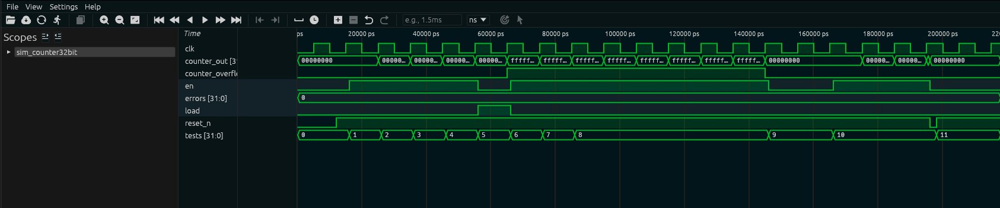

# Contador 32 bits com Overflow — Guia Didático

## 1. O que é este circuito?

Imagine o **hodômetro do carro** — aquele contador de quilômetros que vai subindo a cada quilômetro rodado. Ele começa no zero, vai subindo, e quando chega no máximo... zera e começa de novo. Este circuito é a versão eletrônica disso, mas contando pulsos de clock e capaz de ir até 4.294.967.295 (o número máximo em 32 bits).

A grande diferença do hodômetro: este contador tem três recursos extras:

- Um botão de **reset** que zera tudo instantaneamente
- Um botão de **pausa** (`en = 0`) que congela a contagem
- Uma entrada **load** que permite "teleportar" o contador para um valor específico (como ajustar o hodômetro para um valor pré-definido)
- Um sinal de **overflow** que avisa quando o contador "deu a volta" e zerou

**Analogia alternativa:** Pense em um **cronômetro digital** com a opção de definir o tempo de início. Você pode pausar, reiniciar do zero, ou carregá-lo com um valor próximo do fim para testar o overflow rapidamente.

---

## 2. Como funciona?

A cada pulso de clock, o circuito verifica (nesta ordem de prioridade, com um detalhe importante de bug):

1. **Reset (`reset_n = 0`)?** Zera o contador.
2. **Load (`load = 1`)?** Carrega o valor pré-definido `0xFFFFFFF8` com o bit 32 em 1.
3. **Enable (`en = 1`)?** Incrementa o contador em 1.

O contador usa internamente **33 bits** (não 32!). O bit extra (bit 32) é o **bit de overflow** — ele fica em `1` quando o valor passou de `0xFFFFFFFF`. A saída `counter_out` mostra apenas os 32 bits inferiores, e `counter_overflow` mostra só o bit 32.

**O que é overflow?** Quando o contador chega em `0xFFFFFFFF` (4.294.967.295) e recebe mais um incremento, os 32 bits "dão a volta" para `0x00000000`. O bit 33 (bit de overflow) registra esse evento. É como o hodômetro que passa de 999.999 para 000.000 — você sabe que deu uma volta.

> **Atenção: BUG no RTL!** O código usa `if` separados em vez de `else if`. Veja a seção do código para detalhes.

---

## 3. Os sinais explicados

| Sinal              | Direção | Largura | O que faz                                                       |
| ------------------ | ------- | ------- | --------------------------------------------------------------- |
| `clk`              | Entrada | 1 bit   | Clock do sistema — cada pulso pode incrementar o contador       |
| `reset_n`          | Entrada | 1 bit   | Reset ativo em nível baixo: `0` zera tudo imediatamente         |
| `en`               | Entrada | 1 bit   | Enable: `1` permite contar, `0` pausa (congela)                 |
| `load`             | Entrada | 1 bit   | Carrega o valor `0xFFFFFFF8` no contador (8 passos do overflow) |
| `counter_out`      | Saída   | 32 bits | Valor atual do contador (0 a 4.294.967.295)                     |
| `counter_overflow` | Saída   | 1 bit   | `1` quando o contador ultrapassou 32 bits                       |

---

## 4. O código RTL linha a linha

```verilog
module counter_overflow(
    clk,
    reset_n,
    en,
    load,
    counter_out,
    counter_overflow
);
```

**Declaração do módulo:** Define o nome `counter_overflow` e lista os pinos.

```verilog
input clk, reset_n;
input en;
input load;
output [31:0] counter_out;
output counter_overflow;
```

**Tipos dos pinos:** Saídas de 32 bits para a contagem e 1 bit para o overflow.

```verilog
reg [32:0] counter_reg;
wire load;
```

**Registrador de 33 bits:** O segredo está aqui — `counter_reg` tem 33 bits (índices 32 a 0). O bit 32 é o de overflow, os bits 31 a 0 são a contagem visível. É como ter um dígito secreto extra no hodômetro que acende uma luz quando deu a volta.

```verilog
assign counter_overflow = counter_reg[32];
assign counter_out = counter_reg[31:0];
```

**Divisão da saída:** `counter_overflow` pega apenas o bit 32 (o bit mais alto). `counter_out` pega os 32 bits inferiores. O operador `assign` é como ligar um fio diretamente — sem clock, sem delay.

```verilog
always @(posedge clk or negedge reset_n)
begin
    if (!reset_n) begin
        counter_reg <= 33'd0;
    end
```

**Reset assíncrono:** Quando `reset_n` cai para `0`, zera os 33 bits imediatamente, sem esperar o clock.

```verilog
    if (load)
        counter_reg <= 33'b111111111111111111111111111111000;
```

**Load — o BUG aparece aqui:** Este `if` deveria ser `else if`. Como é um `if` separado, ele sempre executa após o reset, podendo sobrescrever o zero recém-atribuído. O valor `33'b111...11000` em hexadecimal é `overflow=1, counter_out=0xFFFFFFF8` — exatamente 8 passos antes do wrap de 32 bits (voltando a zero).

```verilog
    if (en)
        counter_reg <= counter_reg + 33'd1;
end
```

**Incremento — o BUG se aprofunda:** Outro `if` separado. Se `en` e `load` estiverem ativos ao mesmo tempo, **ambas as atribuições não-bloqueantes (`<=`) são programadas**, mas como `en` vem depois, o incremento sobrescreve o load. Isso significa que a **prioridade real** é: `en > load > reset_n`. O inverso do que parece ser intenção do design.

> **Resumo do bug:** Com `if` separados e atribuições `<=`, a última atribuição ganha. A ordem correta deveria ser `else if (load) ... else if (en)`.

---

## 5. O testbench explicado

O testbench é cuidadosamente construído para explorar todos os comportamentos, incluindo o bug:

```verilog
// Gera clock de período 10 ns
always #5 clk = ~clk;

initial begin
    // Reset inicial
    clk=0; reset_n=0; en=0; load=0;
    @(posedge clk); #1; reset_n=1;
    // Verifica: cnt=0, overflow=0
```

**Teste de contagem básica:**

```verilog
    en = 1; load = 0;
    repeat(8) @(posedge clk);
    // Verifica que contou de 1 a 8, mostra cada ciclo
```

**Teste de congelamento:**

```verilog
    en = 0;  // para a contagem
    @(posedge clk); #1;
    // Verifica que cnt ainda é 8 (não avançou)
```

**Teste de load — o teste mais importante:**

```verilog
    load = 1; en = 0;  // IMPORTANTE: en=0 para load funcionar (por causa do bug)
    @(posedge clk); #1;
    load = 0;
    // Verifica: cnt=0xFFFFFFF8, overflow=1

    // Agora conta a partir de 0xFFFFFFF8
    en = 1;
    repeat(10) @(posedge clk);
    // Observa o wrap em 0xFFFFFFFF → 0x00000000
```

**Por que `en=0` durante o load?** Causa do bug! Se `en=1` e `load=1` ao mesmo tempo, o incremento sobrescreve o load. O testbench contorna isso desligando `en` durante o load.

---

## 6. Resultado real da simulação

```
  SIMULACAO: Contador 32 bits com Overflow
  Funcao: contar de 0 ate 4.294.967.295 (2^32 - 1)
  [RESET] cnt=0 overflow=0  [OK]

  --- Contagem basica (en=1, load=0) ---
  ciclo | counter_out | overflow
    1   | 00000000001 | 0
    2   | 00000000002 | 0
    3   | 00000000003 | 0
    4   | 00000000004 | 0
    5   | 00000000005 | 0
    6   | 00000000006 | 0
    7   | 00000000007 | 0
    8   | 00000000008 | 0

  --- Freeze: en=0 para a contagem ---
  en=0 -> cnt=8 (deve manter 8)  [OK - congelou]

  --- Load: carrega 0xFFFFFFF8 (decimal 4294967288) ---
  Isso = 8 posicoes antes do overflow!
  load=1 en=0 -> cnt=0xfffffff8 ovf=1  [OK]

  --- Contando a partir de 0xFFFFFFF8 ate overflow ---
     1  | 0xfffffff9  |    1     | 4294967289
     2  | 0xfffffffa  |    1     | 4294967290
     3  | 0xfffffffb  |    1     | 4294967291
     4  | 0xfffffffc  |    1     | 4294967292
     5  | 0xfffffffd  |    1     | 4294967293
     6  | 0xfffffffe  |    1     | 4294967294
     7  | 0xffffffff  |    1     | 4294967295
     8  | 0x00000000  |    0     | 0   <- wrap!
     9  | 0x00000001  |    0     | 1
    10  | 0x00000002  |    0     | 2

  BUG NO RTL: if separados em vez de else if
  reset_n=0 (com en=0) -> cnt=0 ovf=0  [OK]
  RESULTADO FINAL: TODOS OS TESTES PASSARAM (0 erros)
```

---

## 7. Interpretando os resultados

**`[RESET] cnt=0 overflow=0 [OK]`**
Estado inicial correto: ao aplicar reset, tudo vai a zero.

**`ciclos 1 a 8: 1, 2, 3, ... 8 | overflow=0`**
Contagem linear simples. O overflow permanece `0` porque ainda estamos longe do valor máximo. Nota: o overflow começa em `1` logo após o load — isso porque o valor `0xFFFFFFF8` carregado inclui o bit 32 em `1`.

**`en=0 -> cnt=8 (deve manter 8) [OK - congelou]`**
Quando desligamos o enable, o contador para exatamente onde estava. O valor `8` se mantém por quantos clocks quisermos.

**`load=1 en=0 -> cnt=0xfffffff8 ovf=1 [OK]`**
Após o load, o contador salta diretamente para `4.294.967.288` com o bit de overflow já em `1`. Isso é proposital: o valor carregado (`33'b111...11000`) inclui o bit de overflow.

**`ciclo 7: 0xffffffff | ovf=1`**
O contador chega ao valor máximo de 32 bits: 4.294.967.295. Próximo passo será o wrap.

**`ciclo 8: 0x00000000 | ovf=0 <- wrap!`**
O grande momento: `0xFFFFFFFF + 1` com 33 bits resulta em `0x100000000`. Os 32 bits inferiores são `0x00000000` e o bit 32 zera também (passou de `1` para `0`). É o "hodômetro dando a volta".

**`ciclos 9 e 10: 0x00000001, 0x00000002`**
Após o wrap, a contagem continua normalmente a partir do zero.

**`BUG NO RTL: if separados em vez de else if`**
O testbench detecta e documenta o bug. O design funciona nos testes porque foram cuidadosamente escritos para evitar os casos problemáticos.

---

## 8. Waveform da Simulação Real

A captura abaixo foi gerada no Surfer após rodar `make wave BLOCK=counter32bit`:



**O que é visível na imagem:**

Esta é a simulação mais longa (cerca de 200.000 ps) porque precisa contar desde `0xFFFFFFF8` até o wrap em `0x00000000`.

**`counter_out[31:0]`**: começa em `00000000` (reset), depois sobe nos primeiros ciclos (contagem de 0 a 4). Após o load, salta para o bloco de valores `fffff...` — você vê claramente a série `fffffff8`, `fffffff9`, ..., `ffffffff`. Logo em seguida, `counter_out` cai abruptamente para `00000000` (o wrap). Depois sobe novamente.

**`counter_overflow`**: fica em `0` durante a contagem inicial. Sobe para `1` imediatamente após o load (o valor `0xFFFFFFF8` carregado já tem o bit 32 em `1`). Permanece `1` durante toda a contagem até `0xFFFFFFFF` e **cai para `0`** no mesmo ciclo do wrap — esse momento de `overflow: 1 → 0` junto com `counter_out: FFFFFFFF → 00000000` é o instante mais visualmente marcante do waveform.

**`load`**: aparece como um pulso estreito (1 ciclo de clock) — visível como uma barra fina na linha `load`.

**`en`**: sobe após reset, cai para `0` no teste de freeze (counter_out para), depois sobe novamente. Cai novamente antes do reset assíncrono final.

**`tests[31:0]`**: sobe de `0` até `11`, confirmando 11 testes. **`errors[31:0]`**: permanece em `0`.
