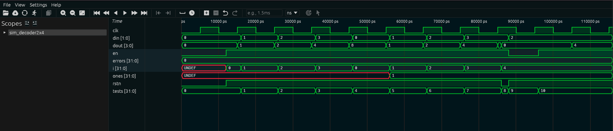

# Decodificador 2x4 (decoder2x4)

## 1. O que é este circuito?

Pense num sistema de elevador com 4 andares. Você aperta dois botões ao mesmo tempo para indicar o andar desejado (00 = térreo, 01 = 1° andar, 10 = 2° andar, 11 = 3° andar). O elevador precisa acender a lâmpada do andar correto e apagar todas as outras.

O **decodificador 2x4** faz exatamente isso: recebe um **número de 2 bits** como entrada e "acende" exatamente **1 entre 4 saídas possíveis**, deixando as outras três apagadas.

Esse padrão — onde apenas uma saída é 1 e todas as outras são 0 — tem um nome especial: **one-hot** (literalmente "uma quente"). É como uma chama que pode estar em apenas um lugar por vez.

O nome "2x4" indica: **2 bits de entrada, 4 saídas**.

Outro exemplo do cotidiano: um árbitro de competição com 4 juízes. Os competidores têm números de 00 a 11. O árbitro aperta o número do juiz que deve pontuar, e apenas esse juiz recebe o sinal — os outros três ficam em silêncio.

---

## 2. Como funciona?

1. O circuito recebe 2 bits de entrada (`din`). Com 2 bits é possível representar 4 valores: 00, 01, 10 e 11.
2. A cada borda de subida do clock, o circuito verifica o valor de `din` e "acende" exatamente o bit da saída que corresponde a esse número.
3. Os outros 3 bits da saída ficam em zero.
4. Reset (rstn=0) zera todos os 4 bits da saída imediatamente.
5. Enable (en=0) congela a saída no último valor.

A tabela de conversão é simples e fixa:

| Entrada `din` | Saída `dout` | Bit ativo |
| ------------- | ------------ | --------- |
| `00`          | `0001`       | bit 0     |
| `01`          | `0010`       | bit 1     |
| `10`          | `0100`       | bit 2     |
| `11`          | `1000`       | bit 3     |

---

## 3. Os sinais explicados

| Sinal  | Direção | Tamanho | O que significa na prática                                                    |
| ------ | ------- | ------- | ----------------------------------------------------------------------------- |
| `clk`  | entrada | 1 bit   | Clock do circuito. A cada borda de subida, a saída é atualizada.              |
| `rstn` | entrada | 1 bit   | Reset ativo baixo: quando vale 0, zera toda a saída imediatamente.            |
| `en`   | entrada | 1 bit   | Enable: quando vale 1, o circuito decodifica; quando vale 0, a saída congela. |
| `din`  | entrada | 2 bits  | O número a ser decodificado. Representa os valores 0, 1, 2 ou 3.              |
| `dout` | saída   | 4 bits  | O código one-hot resultante. Apenas 1 dos 4 bits estará em 1 por vez.         |

---

## 4. O código RTL linha a linha

```verilog
module decoder2x4(
    clk,
    rstn,
    en,
    din,
    dout
);
```

Declaração do módulo com seus cinco pinos.

```verilog
input en;
input clk;
input rstn;
input [1:0] din;
```

`din` tem 2 bits (`[1:0]`), representando os valores 0, 1, 2 e 3 em binário. Os colchetes indicam o range de bits: do bit 1 ao bit 0.

```verilog
output [3:0] dout;
```

`dout` tem 4 bits — uma saída para cada valor possível de `din`. Sempre terá exatamente um bit em 1 (one-hot), exceto quando em reset.

```verilog
wire clk;
wire en;
wire rstn;
wire [1:0] din;
reg [3:0] dout;
```

As entradas são `wire` (fios simples). A saída `dout` é `reg` para guardar o valor entre clocks.

```verilog
always @(posedge clk or negedge rstn)
begin
```

Bloco ativo na borda de subida do clock ou na borda de descida do reset. Este é o ponto onde o decodificador "toma sua decisão".

```verilog
    if (!rstn)
        dout = 4'b0000;
```

Reset ativo: zera os 4 bits da saída. `4'b0000` significa "literal binário de 4 bits, todos em zero".

```verilog
    else if (en)
        case (din)
            2'b00: dout = 4'b0001;
            2'b01: dout = 4'b0010;
            2'b10: dout = 4'b0100;
            2'b11: dout = 4'b1000;
            default dout = 4'b0000;
        endcase
```

Aqui está a lógica central. O `case(din)` avalia o valor de `din` e escolhe o resultado:

- `din=00` → `dout=0001`: bit 0 aceso. Em decimal: entrou 0, saiu 1 (com o bit 0 ativo).
- `din=01` → `dout=0010`: bit 1 aceso. Entrou 1, saiu 2 (com o bit 1 ativo).
- `din=10` → `dout=0100`: bit 2 aceso. Entrou 2, saiu 4 (com o bit 2 ativo).
- `din=11` → `dout=1000`: bit 3 aceso. Entrou 3, saiu 8 (com o bit 3 ativo).

O `default` é uma cláusula de segurança — em Verilog, é boa prática cobrir todos os casos possíveis. Para 2 bits, não há valor além de 00-11, mas o `default` protege contra situações inesperadas de simulação.

```verilog
end
endmodule
```

Encerramento do bloco `always` e do módulo.

---

## 5. O testbench explicado

**Etapa 1 — Clock e reset:** O TB gera o clock e aplica reset inicial para colocar o circuito em estado limpo (dout=0000).

**Etapa 2 — Tabela de decodificação completa:** Testa os 4 valores possíveis de `din` (00, 01, 10, 11) em sequência. Para cada valor, verifica:

- Se o dout obtido bate com o esperado.
- Se o dout está no formato one-hot correto.

**Etapa 3 — Verificação one-hot:** Para cada resultado, o TB conta quantos bits da saída estão em 1. Se o número for diferente de 1, é um erro — o one-hot foi violado.

**Etapa 4 — Reset no final:** Confirma que rstn=0 zera a saída.

**Etapa 5 — Relatório final:** Informa se todos os testes passaram ou quantos falharam.

---

## 6. Resultado real da simulação

```
  SIMULACAO: Decodificador 2x4 (decoder2x4)
  Funcao: converter 2 bits em 4 bits one-hot
  One-hot = apenas UM bit ativo por vez
  [RESET] dout=0000  [OK]
  din | dout esperado | dout obtido | qual bit ativo | status
   00 |     0001      |    0001     | bit 0          |    OK
   01 |     0010      |    0010     | bit 1          |    OK
   10 |     0100      |    0100     | bit 2          |    OK
   11 |     1000      |    1000     | bit 3          |    OK
  --- Verificacao one-hot ---
  din=00 -> dout=0001 -> bits ativos=1  [OK one-hot]
  din=01 -> dout=0010 -> bits ativos=1  [OK one-hot]
  din=10 -> dout=0100 -> bits ativos=1  [OK one-hot]
  din=11 -> dout=1000 -> bits ativos=1  [OK one-hot]
  rstn=0 -> dout=0000  [OK]
  RESULTADO FINAL: TODOS OS TESTES PASSARAM (0 erros)
```

---

## 7. Interpretando os resultados

**`[RESET] dout=0000 [OK]`**
O circuito iniciou corretamente com todas as saídas em zero.

**Linha: `din=00, dout=0001, bit 0 ativo`**
Entrou o número 0 (binário 00). Saiu o código one-hot `0001`, onde o bit 0 (o mais à direita) está aceso. Correto — quando você diz "0", o pino 0 se acende.

**Linha: `din=01, dout=0010, bit 1 ativo`**
Entrou o número 1 (binário 01). Saiu `0010`, onde o bit 1 está aceso. O bit "caminhou" uma posição para a esquerda.

**Linha: `din=10, dout=0100, bit 2 ativo`**
Entrou o número 2 (binário 10). Saiu `0100`. O bit continua se deslocando para a esquerda.

**Linha: `din=11, dout=1000, bit 3 ativo`**
Entrou o número 3 (binário 11). Saiu `1000` — o bit mais à esquerda está aceso.

**Seção "Verificacao one-hot":**
Para cada resultado, o TB contou quantos bits estão em 1 no dout. Em todos os casos, `bits ativos=1`, confirmando que o padrão one-hot foi respeitado. Isso é uma verificação de qualidade adicional.

**`rstn=0 -> dout=0000 [OK]`**
O reset zerou corretamente todas as saídas.

**`RESULTADO FINAL: TODOS OS TESTES PASSARAM (0 erros)`**
O decodificador está funcionando perfeitamente.

---

## 8. Waveform da Simulação Real

A captura abaixo foi gerada no Surfer após rodar `make wave BLOCK=decoder2x4`:



**O que é visível na imagem:**

**`dout[3:0]`**: exibe o padrão one-hot com clareza. A sequência `1` → `2` → `4` → `8` (em hexadecimal) corresponde a `0001` → `0010` → `0100` → `1000` em binário — exatamente um bit ativo se deslocando para a esquerda a cada ciclo. Esse padrão se repete pois o testbench varre `din` de 0 a 3 duas vezes.

**`din[1:0]`**: cicla entre `0` → `1` → `2` → `3` em sincronia com `dout`.

**`ones[31:0]`**: começa como `UNDEF` (X) antes do reset/enable, depois fixa em `1` — confirmando que exatamente um bit está ativo em `dout` em todos os ciclos válidos. Essa linha é a "prova automática" da propriedade one-hot.

**`i[31:0]`**: índice do loop — cicla de `0` a `3` duas vezes (a segunda passagem testa one-hot explicitamente).

**`rstn`**: pulso baixo no início — `dout` vai a `0` imediatamente (assíncrono).

**`tests[31:0]`**: sobe até `10`. **`errors[31:0]`**: permanece em `0`.
