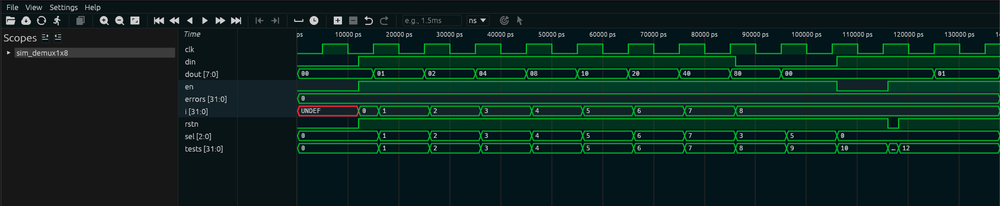

# Demultiplexador 1x8 (demux1x8)

## 1. O que é este circuito?

Imagine uma caixa de correios com 8 gavetas numeradas de 0 a 7. Chega uma carta (o dado de entrada) e você precisa colocá-la exatamente na gaveta certa. Quem decide em qual gaveta a carta vai parar é o número que você escreve em um seletor — os bits de seleção.

O **demultiplexador 1x8** faz exatamente isso: recebe **1 entrada** e a direciona para **1 entre 8 saídas possíveis**. As outras 7 saídas ficam com zero.

Outro exemplo do dia a dia: pense num comutador de trilhos de trem. O trem (o dado) sai de uma estação central e você abre o trilho certo (a saída selecionada) para ele passar. Os outros trilhos ficam fechados.

O nome "1x8" vem dessa proporção: **1 entrada, 8 saídas**.

---

## 2. Como funciona?

O funcionamento é direto:

1. O circuito recebe um bit de entrada chamado `din` — o dado que vai ser distribuído.
2. Você informa qual das 8 saídas deve receber esse dado usando 3 bits chamados `sel` (seletor). Com 3 bits é possível formar 8 combinações: 000, 001, 010, 011, 100, 101, 110, 111 — representando os números 0 a 7.
3. A cada borda de subida do clock, o circuito olha qual é o valor de `sel` e copia `din` para a saída correspondente. Todas as outras saídas ficam em zero.
4. Se o reset estiver ativo (rstn = 0), todas as saídas vão imediatamente para zero, independente de qualquer coisa.
5. Se o enable estiver desligado (en = 0), o circuito para de atualizar — as saídas "congelam" no último valor que tinham.

---

## 3. Os sinais explicados

| Sinal  | Direção | Tamanho | O que significa na prática                                                    |
| ------ | ------- | ------- | ----------------------------------------------------------------------------- |
| `clk`  | entrada | 1 bit   | O "pulso cardíaco" do circuito. A cada batida, os valores são atualizados.    |
| `rstn` | entrada | 1 bit   | Reset ativo em nível baixo: quando vale 0, zera tudo imediatamente.           |
| `en`   | entrada | 1 bit   | Enable: quando vale 1, o circuito funciona; quando vale 0, congela as saídas. |
| `sel`  | entrada | 3 bits  | O número da saída de destino (0 a 7). Três bits permitem 8 endereços.         |
| `din`  | entrada | 1 bit   | O dado que você quer distribuir. Pode ser 0 ou 1.                             |
| `dout` | saída   | 8 bits  | As 8 saídas possíveis. Apenas uma terá o valor de `din`; o resto é zero.      |

---

## 4. O código RTL linha a linha

```verilog
module demux1x8(
    clk,
    rstn,
    en,
    sel,
    din,
    dout
);
```

Aqui declaramos o módulo com seu nome e listamos todos os pinos que ele possui. É como a etiqueta de uma caixa descrevendo o que entra e o que sai.

```verilog
input clk;
input rstn;
input en;
input [2:0] sel;
input din;
```

Declaração das entradas. O `[2:0]` em `sel` significa "um barramento de 3 bits, numerados do bit 2 ao bit 0". Isso permite representar os valores 0 a 7 em binário.

```verilog
output [7:0] dout;
```

A saída tem 8 bits — uma posição para cada canal possível de destino.

```verilog
wire clk;
wire rstn;
wire en;
wire din;
wire [2:0] sel;
reg [7:0] dout;
```

`wire` é como um fio simples — só conduz o sinal sem guardar nada. `reg` é um registrador — ele guarda o valor entre um clock e outro. Como `dout` precisa ser memorizado até o próximo clock, ele é `reg`.

```verilog
always @(posedge clk or negedge rstn)
begin
```

Este bloco é executado toda vez que o clock sobe (borda positiva — `posedge`) **ou** quando rstn cai para zero (borda negativa do reset — `negedge rstn`). É aqui que toda a lógica acontece.

```verilog
    if (!rstn)
        dout = 0;
```

Se o reset estiver ativo (rstn vale 0, então `!rstn` é verdadeiro), todas as 8 saídas vão para zero imediatamente. Isso é o reset assíncrono — não precisa esperar o clock.

```verilog
    else if (en)
        case(sel)
```

Se o reset não estiver ativo E o enable estiver ligado (en=1), entramos no `case` para decidir qual saída ativar com base no valor de `sel`.

```verilog
            3'b000: begin
                dout[0] = din;
                dout[7:1] = 7'b0;
            end
```

Quando `sel` é `000` (número 0 em binário), o bit 0 da saída recebe o valor de `din`. Todos os outros bits (1 a 7) são zerados. A notação `3'b000` significa "literal binário de 3 bits com valor 000".

O mesmo padrão se repete para cada valor de `sel` de `001` a `111`, sempre ativando o bit correspondente e zerando os demais:

- `sel=001` → dout[1] = din, resto = 0
- `sel=010` → dout[2] = din, resto = 0
- ...
- `sel=111` → dout[7] = din, resto = 0

```verilog
        endcase
end
endmodule
```

`endcase` fecha o bloco de seleção. `end` fecha o `always`. `endmodule` encerra a definição do módulo.

---

## 5. O testbench explicado

O testbench (TB) é um programa de teste que simula o circuito. Ele não faz parte do hardware — serve apenas para verificar se o RTL funciona corretamente antes de gravar em chip ou FPGA.

**O que o TB faz neste caso:**

**Etapa 1 — Geração do clock:** Cria um sinal que alterna entre 0 e 1 a cada 5ns, simulando um clock de 100 MHz. Sem clock, o circuito não evolui.

**Etapa 2 — Reset inicial:** Coloca rstn=0 por 12ns para garantir que o circuito começa em estado conhecido (todas as saídas em zero). Isso simula o momento em que você liga a placa.

**Etapa 3 — Testa todos os canais com din=1:** Num laço, percorre sel de 000 a 111 com din=1. Para cada valor de sel, espera um clock e compara o resultado obtido com o esperado. Qualquer divergência é contada como erro.

**Etapa 4 — Testa canal com din=0:** Coloca din=0 com sel=011 e verifica que dout fica todo em zero — o circuito distribui o que recebe, mesmo que seja zero.

**Etapa 5 — Testa o congelamento (en=0):** Desliga o enable e muda sel/din. Verifica que dout não muda — ele deve "congelar" no último valor registrado.

**Etapa 6 — Testa reset sem clock:** Aplica rstn=0 e verifica que dout vai a zero mesmo sem borda de clock, confirmando o comportamento assíncrono.

**Etapa 7 — Contagem de erros:** Se qualquer resultado obtido diferir do esperado, um contador de erros é incrementado. No final, o TB imprime "TODOS OS TESTES PASSARAM" ou o número de falhas encontradas.

---

## 6. Resultado real da simulação

```
  SIMULACAO: Demultiplexador 1x8 (demux1x8)
  Funcao: rotear din para dout[sel]
  [RESET] rstn=0 por 12ns -> dout deve ser 00000000
  dout = 00000000  [OK]
  --- Teste: sel 0..7 com din=1 ---
  sel | din | dout esperado  | dout obtido    | status
   000 |  1  | 00000001       | 00000001       |    OK
   001 |  1  | 00000010       | 00000010       |    OK
   010 |  1  | 00000100       | 00000100       |    OK
   011 |  1  | 00001000       | 00001000       |    OK
   100 |  1  | 00010000       | 00010000       |    OK
   101 |  1  | 00100000       | 00100000       |    OK
   110 |  1  | 01000000       | 01000000       |    OK
   111 |  1  | 10000000       | 10000000       |    OK
  sel=011 din=0 -> dout=00000000  [OK]
  en=0, mudamos sel/din -> dout=00000100 (antes=00000100) [OK - congelou]
  rstn=0 (sem clock) -> dout=00000000  [OK]
  RESULTADO FINAL: TODOS OS TESTES PASSARAM (0 erros)
```

---

## 7. Interpretando os resultados

**`[RESET] rstn=0 por 12ns -> dout = 00000000 [OK]`**
O circuito iniciou corretamente com todas as saídas em zero. O reset funcionou como esperado.

**Linha: `sel=000, dout=00000001`**
O bit mais à direita (posição 0) foi para 1. Correto — sel=000 deve ativar dout[0].

**Linha: `sel=001, dout=00000010`**
O segundo bit da direita (posição 1) foi para 1. O bit 0 voltou a zero. Correto.

**Linha: `sel=010, dout=00000100`**
O terceiro bit (posição 2) foi para 1. Correto.

**Padrão geral dos testes:**
A cada incremento de sel, o bit ativo se desloca uma posição para a esquerda. É como uma lâmpada que "caminha" da direita para a esquerda no barramento de 8 bits.

**`sel=111, dout=10000000`**
O bit mais à esquerda (posição 7) foi para 1. Correto — sel=111 (7 em decimal) ativa dout[7].

**`sel=011 din=0 -> dout=00000000 [OK]`**
Com din=0, mesmo que sel aponte para uma saída, essa saída fica em 0. O circuito apenas distribui o que recebe — não "inventa" valor.

**`en=0, mudamos sel/din -> dout=00000100 (antes=00000100) [OK - congelou]`**
Com enable desligado, o circuito ignorou as mudanças de sel e din. O valor `00000100` foi mantido do ciclo anterior. O circuito "congelou" como esperado.

**`rstn=0 (sem clock) -> dout=00000000 [OK]`**
O reset é assíncrono: zera tudo imediatamente, sem precisar esperar um pulso de clock. Isso é confirmado aqui.

**`RESULTADO FINAL: TODOS OS TESTES PASSARAM (0 erros)`**
Todos os cenários foram verificados e nenhum erro foi encontrado. O RTL está correto.

---

## 8. Waveform da Simulação Real

A captura abaixo foi gerada no Surfer após rodar `make wave BLOCK=1x8demux`:



**O que é visível na imagem:**

**`dout[7:0]`** (terceira linha): este é o sinal mais visualmente interessante. Você vê a sequência one-hot caminhando da direita para a esquerda: `01` → `02` → `04` → `08` → `10` → `20` → `40` → `80`. Cada valor tem exatamente um bit ativo, confirmando o comportamento one-hot do demux. Depois volta para `00` (teste de din=0) e reaparece `01` no final.

**`sel[2:0]`**: incrementa de `0` até `7` em sincronia com `dout`, depois reverte para `3` e `5` nos testes extras, e fecha em `0`.

**`din`**: fica em `1` durante os testes principais, vai para `0` no teste de "din=0 apaga a saída".

**`i[31:0]`**: o índice do loop do testbench — sobe de `0` até `8`, mostrando os 8 canais testados.

**`rstn`**: pulso baixo breve no início — `dout` vai a `00` imediatamente (reset assíncrono), antes de qualquer clock.

**`tests[31:0]`**: sobe de `0` até `12`. **`errors[31:0]`**: permanece em `0`.
