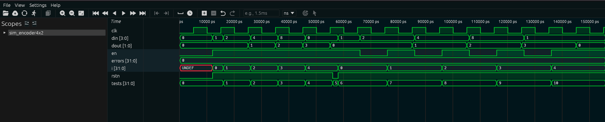

# Codificador 4x2 (encoder4x2)

## 1. O que é este circuito?

Pense num caixa eletrônico com 4 botões de serviço: "Saque", "Depósito", "Extrato" e "Transferência". Cada botão físico ocupa um fio separado na placa. Mas o processador interno trabalha com números — ele não quer saber de 4 fios separados, quer saber o número do serviço escolhido (0, 1, 2 ou 3).

O **codificador 4x2** converte essa informação: recebe **4 entradas** (onde apenas uma está ativa — one-hot) e produz o **número correspondente em 2 bits** na saída.

Ele é o **inverso exato do decodificador 2x4**: enquanto o decoder transforma um número binário em um código one-hot, o encoder transforma um código one-hot de volta em número binário.

O nome "4x2" indica: **4 entradas, 2 bits de saída**.

Outro exemplo: um teclado de calculadora tem 10 teclas (0-9). Cada tecla é um fio separado. O encoder traduz o fio que foi pressionado para o número equivalente em binário.

---

## 2. Como funciona?

1. O circuito recebe 4 bits de entrada (`din`). Apenas um deles deve estar em 1 por vez — esse é o código one-hot.
2. A cada borda de subida do clock, o circuito identifica qual bit está ativo e gera o número binário de 2 bits correspondente.
3. A tabela de conversão é o inverso do decodificador:

| Entrada `din` (one-hot) | Bit ativo | Saída `dout` (binário) |
| ----------------------- | --------- | ---------------------- |
| `0001`                  | bit 0     | `00` (número 0)        |
| `0010`                  | bit 1     | `01` (número 1)        |
| `0100`                  | bit 2     | `10` (número 2)        |
| `1000`                  | bit 3     | `11` (número 3)        |

4. Reset (rstn=0) zera a saída imediatamente.
5. Enable (en=0) congela a saída.
6. Se `din=0000` (nenhum bit ativo) ou qualquer valor que não seja one-hot válido, o circuito usa o valor padrão `00`.

---

## 3. Os sinais explicados

| Sinal  | Direção | Tamanho | O que significa na prática                                                        |
| ------ | ------- | ------- | --------------------------------------------------------------------------------- |
| `clk`  | entrada | 1 bit   | Clock do circuito. A cada borda de subida, a conversão é atualizada.              |
| `rstn` | entrada | 1 bit   | Reset ativo baixo: quando vale 0, a saída vai a zero imediatamente.               |
| `en`   | entrada | 1 bit   | Enable: quando vale 1, o circuito funciona; quando vale 0, a saída congela.       |
| `din`  | entrada | 4 bits  | O código one-hot de entrada. Apenas um bit deve estar em 1 por vez.               |
| `dout` | saída   | 2 bits  | O número binário correspondente ao bit ativo. Representa os valores 0, 1, 2 ou 3. |

---

## 4. O código RTL linha a linha

```verilog
module encoder4x2(
    din,
    clk,
    dout,
    rstn,
    en
);
```

Declaração do módulo. Note que aqui a lista de pinos mistura entradas e saídas — isso é permitido em Verilog. A ordem da lista não importa, apenas a declaração posterior como `input`/`output` define a função de cada um.

```verilog
input en;
input clk;
input rstn;
input [3:0] din;
```

`din` tem 4 bits (`[3:0]`): são as 4 possíveis entradas one-hot. O range `[3:0]` vai do bit mais significativo (3) ao menos significativo (0).

```verilog
output [1:0] dout;
```

`dout` tem 2 bits — suficientes para representar os números 0, 1, 2 e 3 em binário.

```verilog
wire en;
wire rstn;
wire [3:0] din;
reg [1:0] dout;
```

Entradas como `wire`, saída como `reg` para memorizar o valor.

```verilog
always @(posedge clk or negedge rstn)
begin
```

Bloco sensível à borda de subida do clock e ao reset assíncrono.

```verilog
    if (!rstn)
        dout = 2'b00;
```

Reset: saída vai para `00` imediatamente. `2'b00` é o literal binário de 2 bits com valor zero.

```verilog
    else if (en)
        case (din)
            4'b0001: dout = 2'b00;
            4'b0010: dout = 2'b01;
            4'b0100: dout = 2'b10;
            4'b1000: dout = 2'b11;
            default dout = 2'b00;
        endcase
```

O `case(din)` identifica qual padrão one-hot está presente na entrada e gera o número correspondente:

- `din=0001` (bit 0 ativo) → `dout=00` (número 0)
- `din=0010` (bit 1 ativo) → `dout=01` (número 1)
- `din=0100` (bit 2 ativo) → `dout=10` (número 2)
- `din=1000` (bit 3 ativo) → `dout=11` (número 3)
- `default` cobre o caso de `din=0000` ou qualquer valor inválido (ex: `din=0101` com dois bits ativos ao mesmo tempo) — retorna `00`.

Perceba a simetria perfeita com o decodificador:

- O **decoder** recebe `2'b01` e produz `4'b0010`.
- O **encoder** recebe `4'b0010` e produz `2'b01`.
  São operações inversas.

```verilog
end
endmodule
```

Encerramento do bloco e do módulo.

---

## 5. O testbench explicado

**Etapa 1 — Clock e reset:** Aplica reset inicial para garantir que dout começa em zero.

**Etapa 2 — Testa os 4 casos one-hot válidos:** Aplica cada um dos 4 padrões one-hot válidos na entrada e verifica se o número binário de saída está correto:

- `din=0001` → espera `dout=00`
- `din=0010` → espera `dout=01`
- `din=0100` → espera `dout=10`
- `din=1000` → espera `dout=11`

**Etapa 3 — Testa o caso inválido:** Aplica `din=0000` (nenhum bit ativo) e verifica que `dout=00` — o valor padrão.

**Etapa 4 — Reset final:** Confirma que rstn=0 zera a saída.

**Etapa 5 — Relatório:** Informa o número de erros encontrados.

---

## 6. Resultado real da simulação

```
  SIMULACAO: Codificador 4x2 (encoder4x2)
  Funcao: converter one-hot de 4 bits em binario de 2 bits
  E o inverso do decodificador!
  [RESET] dout=00  [OK]
  din (one-hot) | bit ativo | dout esp | dout obtido | status
      0001      |  bit 0    |    00    |      00     |    OK
      0010      |  bit 1    |    01    |      01     |    OK
      0100      |  bit 2    |    10    |      10     |    OK
      1000      |  bit 3    |    11    |      11     |    OK
  din=0000 -> dout=00  [OK - default]
  rstn=0 -> dout=00  [OK]
  RESULTADO FINAL: TODOS OS TESTES PASSARAM (0 erros)
```

---

## 7. Interpretando os resultados

**`[RESET] dout=00 [OK]`**
O circuito iniciou corretamente com a saída em zero.

**Linha: `din=0001, bit 0, dout=00`**
Entrou o código one-hot com o bit 0 ativo. Saiu `00` em binário, que representa o número 0. O encoder "reconheceu" que o bit 0 estava ativo e produziu o número 0 como código.

**Linha: `din=0010, bit 1, dout=01`**
Entrou o código one-hot com o bit 1 ativo. Saiu `01` em binário, que representa o número 1.

**Linha: `din=0100, bit 2, dout=10`**
Entrou o código one-hot com o bit 2 ativo. Saiu `10` em binário, que representa o número 2. Note: `10` em binário é o número 2, não o número 10 — é fácil se confundir aqui.

**Linha: `din=1000, bit 3, dout=11`**
Entrou o código one-hot com o bit 3 ativo. Saiu `11` em binário, que representa o número 3. O bit mais à esquerda de `din` se traduz no maior número possível de 2 bits.

**`din=0000 -> dout=00 [OK - default]`**
Quando nenhum bit está ativo, o `default` do `case` garante que a saída seja `00`. O circuito não trava nem produz valor indefinido.

**`rstn=0 -> dout=00 [OK]`**
Reset assíncrono confirmado.

**`RESULTADO FINAL: TODOS OS TESTES PASSARAM (0 erros)`**
O encoder está correto.

---

## 8. Na prática: para que serve e quando usar?

O encoder é o **compactador de eventos físicos**. Ele converte sinais paralelos do mundo físico (botões, sensores, interruptores) em um código numérico compacto que o processador consegue trabalhar.

**Onde aparece na vida real:**
- **Teclados e painéis de botões:** cada tecla física é um fio. O encoder converte "qual fio está ativo" em um número — o código da tecla — para o microcontrolador processar. Sem o encoder, você precisaria de um pino do processador para cada botão.
- **Detecção de prioridade (priority encoder):** em sistemas com múltiplas interrupções simultâneas, o encoder identifica qual interrupção tem maior prioridade e entrega o número dela para o controlador de interrupções.
- **Sensores industriais:** sensores de posição absoluta (encoders ópticos, por exemplo) geram código Gray ou one-hot — e um encoder digital converte esse padrão em valor numérico para o sistema de controle.
- **Interfaces com hardware legado:** chips antigos muitas vezes expõem seus estados como sinais individuais. O encoder é o adaptador que traduz esses sinais para os barramentos modernos.

**Quando escolher um encoder:** sempre que você tiver sinais físicos paralelos (um por evento/botão/sensor) e precisar convertê-los em um número para processar. É o passo de entrada do mundo físico para o mundo digital.

---

## 9. Waveform da Simulação Real

A captura abaixo foi gerada no Surfer após rodar `make wave BLOCK=encoder4x2`:



Se você colocar o waveform do decoder e o do encoder lado a lado, vai ver que são espelhos. No decoder, `din` subia (0→1→2→3) e `dout` exibia o padrão one-hot. Aqui no encoder é o contrário: `din` exibe o padrão one-hot (`1 → 2 → 4 → 8`) e `dout` sobe em binário (`00 → 01 → 10 → 11`). A operação inversa confirmada visualmente.

O momento mais interessante é o **pulso de `en=0`** no meio da simulação. Repare que `din` continua mudando — o testbench não para — mas `dout` fica completamente parado, congelado no último valor. Quando `en` volta para 1, `dout` retoma normalmente. É o comportamento de "pausa" que todo registrador com enable deve ter.

O `rstn` zera `dout` para `00` no início. Entradas inválidas (como `0000` com nenhum bit ativo) passam pelo `default` do `case` e retornam `00` sem travar o circuito. `errors` permanece em 0 em todos os 12 testes.
