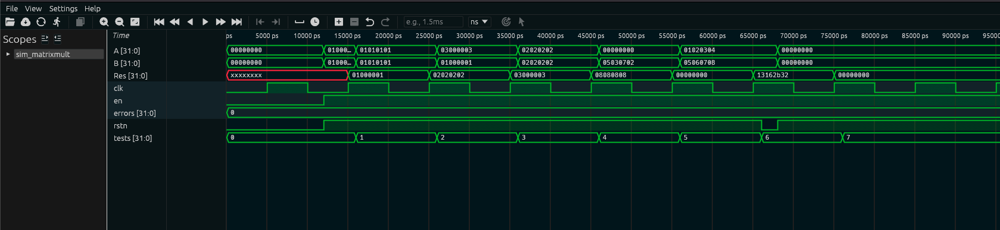

# Multiplicador de Matrizes 2x2 — Guia Didático

## 1. O que é este circuito?

Imagine que você está em uma aula de álgebra linear e precisa multiplicar duas matrizes 2x2. Na mão, você faz isso anotando os elementos em uma folha, multiplicando linhas por colunas e somando os produtos. Este circuito faz exatamente isso em hardware — só que em nanosegundos.

**Analogia do dia a dia:** Pense em uma **planilha do Excel automática**. Você digita os números das duas matrizes nas células de entrada, aperta "Enter" (o clock), e a planilha já te mostra a multiplicação das matrizes calculada. Aqui, o "Excel" é feito de transistores.

Uma matriz 2x2 tem 4 elementos. Cada elemento ocupa 8 bits (um número de 0 a 255). As duas matrizes juntas precisam de 4 × 8 = 32 bits cada — e é por isso que as entradas `A` e `B` são palavras de 32 bits. O resultado `Res` também é 32 bits pelos mesmos motivos.

**Por que isso é útil?** Multiplicação de matrizes é o coração de gráficos 3D, inteligência artificial, processamento de imagens e comunicações digitais. Ter isso em hardware dedicado é muito mais rápido que rodar em software.

---

## 2. Como funciona?

O circuito opera em duas etapas distintas:

**Etapa 1 — Desempacotamento (combinacional, sem clock):**
Assim que `A` ou `B` mudam de valor, o circuito imediatamente "abre" as palavras de 32 bits e separa os 4 elementos de 8 bits de cada matriz. Não precisa de clock para isso.

**Etapa 2 — Cálculo e empacotamento (síncrono, com clock):**
Na borda de subida do clock, se `en = 1`, o circuito:

1. Calcula os 4 elementos da matriz resultado usando a fórmula de multiplicação matricial
2. Empacota os 4 resultados em uma única palavra de 32 bits
3. Armazena em `Res`

**A fórmula matemática usada:**

```
C[0][0] = A[0][0] × B[0][0] + A[0][1] × B[1][0]
C[0][1] = A[0][0] × B[0][1] + A[0][1] × B[1][1]
C[1][0] = A[1][0] × B[0][0] + A[1][1] × B[1][0]
C[1][1] = A[1][0] × B[0][1] + A[1][1] × B[1][1]
```

Para quem não lembra da álgebra: cada elemento da matriz resultado é calculado multiplicando uma **linha de A** por uma **coluna de B** e somando os produtos.

---

## 3. Os sinais explicados

| Sinal  | Direção | Largura | O que faz                                                    |
| ------ | ------- | ------- | ------------------------------------------------------------ |
| `clk`  | Entrada | 1 bit   | Clock — pulsos regulares que sincronizam o cálculo           |
| `rstn` | Entrada | 1 bit   | Reset ativo em nível baixo: `0` zera a saída, `1` = normal   |
| `en`   | Entrada | 1 bit   | Enable: `1` executa o cálculo, `0` mantém o último resultado |
| `A`    | Entrada | 32 bits | Primeira matriz 2x2 empacotada (4 elementos de 8 bits)       |
| `B`    | Entrada | 32 bits | Segunda matriz 2x2 empacotada (4 elementos de 8 bits)        |
| `Res`  | Saída   | 32 bits | Resultado C = A × B empacotado (4 elementos de 8 bits)       |

**Como os 32 bits representam uma matriz 2x2:**

```
Bits [31:24] → elemento [linha 0][coluna 0]   (canto superior esquerdo)
Bits [23:16] → elemento [linha 0][coluna 1]   (canto superior direito)
Bits [15: 8] → elemento [linha 1][coluna 0]   (canto inferior esquerdo)
Bits [ 7: 0] → elemento [linha 1][coluna 1]   (canto inferior direito)
```

Exemplo: a identidade `[[1,0],[0,1]]` fica empacotada como `0x01000001`.

---

## 4. O código RTL linha a linha

```verilog
module matrix2x2_mult(A, B, Res, clk, rstn, en);
```

**Declaração do módulo:** Define o nome `matrix2x2_mult` e lista todos os pinos na interface.

```verilog
input clk, rstn, en;
input [31:0] A;
input [31:0] B;
output [31:0] Res;
```

**Tipos dos pinos:** As entradas `A` e `B` são palavras de 32 bits. A saída `Res` também é 32 bits. Simples.

```verilog
reg [31:0] Res;
reg [7:0] A1 [0:1][0:1];
reg [7:0] B1 [0:1][0:1];
reg [7:0] Res1 [0:1][0:1];
```

**Estruturas internas de dados:** `A1` e `B1` são arrays 2D de registradores de 8 bits — ou seja, matrizes 2x2 onde cada célula guarda 8 bits. Isso facilita os cálculos. `Res1` é a matriz resultado temporária antes de empacotar.

```verilog
always @ (A or B)
begin
    {A1[0][0], A1[0][1], A1[1][0], A1[1][1]} = A;
    {B1[0][0], B1[0][1], B1[1][0], B1[1][1]} = B;
end
```

**Bloco combinacional de desempacotamento:** Dispara sempre que `A` ou `B` mudam. Usa concatenação `{}` para dividir os 32 bits em 4 grupos de 8 bits. `A1[0][0]` recebe os bits `[31:24]`, `A1[0][1]` recebe `[23:16]`, e assim por diante. Note o uso de `=` (bloqueante) — correto em blocos combinacionais.

```verilog
always @ (posedge clk or negedge rstn)
begin
    if (!rstn) begin
        {Res1[0][0], Res1[0][1], Res1[1][0], Res1[1][1]} = 32'd0;
    end
```

**Bloco sequencial com reset:** Dispara na borda de subida do clock ou quando o reset cai. Se `rstn = 0`, zera todos os elementos da matriz resultado.

```verilog
    else if (en) begin
        Res1[0][0] = (A1[0][0] * B1[0][0]) + (A1[0][1] * B1[1][0]);
        Res1[0][1] = (A1[0][0] * B1[0][1]) + (A1[0][1] * B1[1][1]);
        Res1[1][0] = (A1[1][0] * B1[0][0]) + (A1[1][1] * B1[1][0]);
        Res1[1][1] = (A1[1][0] * B1[0][1]) + (A1[1][1] * B1[1][1]);
```

**Os quatro cálculos matriciais:** Cada linha implementa uma fórmula C[i][j] = soma dos produtos linha × coluna. Por exemplo, `Res1[0][0]` = produto do primeiro elemento da linha 0 de A pelo primeiro elemento da coluna 0 de B, somado ao produto do segundo elemento da linha 0 de A pelo segundo elemento da coluna 0 de B.

```verilog
        Res = {Res1[0][0], Res1[0][1], Res1[1][0], Res1[1][1]};
    end
end
```

**Empacotamento final:** Após calcular os 4 elementos, os junta novamente em uma palavra de 32 bits usando concatenação `{}`. Esta é a saída final que aparece em `Res`.

---

## 5. O testbench explicado

O testbench verifica a multiplicação matricial com casos progressivamente mais complexos:

```verilog
// Instancia o módulo
matrix2x2_mult uut (.A(A), .B(B), .Res(Res), .clk(clk), .rstn(rstn), .en(en));

// Clock: período de 10 unidades
always #5 clk = ~clk;

initial begin
    // Reset inicial
    rstn = 0; en = 0; A = 0; B = 0;
    #10; rstn = 1; en = 1;

    // Teste 1: identidade × identidade
    // [[1,0],[0,1]] empacotado = 0x01000001
    A = 32'h01000001;  B = 32'h01000001;
    @(posedge clk); #1;
    // Verifica se Res == 0x01000001 (identidade)
```

**Por que começar com a identidade?** É o teste mais simples: I × I = I. Se isso falhar, há um problema grave no circuito.

```verilog
    // Teste 3: [[1,2],[3,4]] × [[5,6],[7,8]]
    // A = {8'd1, 8'd2, 8'd3, 8'd4} = 0x01020304
    // B = {8'd5, 8'd6, 8'd7, 8'd8} = 0x05060708
    A = 32'h01020304;  B = 32'h05060708;
    @(posedge clk); #1;
    // Verifica se Res == 0x13162B32
    // (19=0x13, 22=0x16, 43=0x2B, 50=0x32)
```

**Como montar o valor hex:** converta cada elemento para hex e concatene. `19 = 0x13`, `22 = 0x16`, `43 = 0x2B`, `50 = 0x32`. Juntando: `0x13162B32`.

---

## 6. Resultado real da simulação

```
  SIMULACAO: Multiplicador de Matrizes 2x2
  Funcao: C = A x B (matrizes 2x2, elementos 8 bits)
  Formula: C[i][j] = A[i][0]*B[0][j] + A[i][1]*B[1][j]
  Empacotamento: A[31:24]=a00, A[23:16]=a01, A[15:08]=a10, A[07:00]=a11

  TESTE 1: Identidade x Identidade = Identidade
  A = [[1,0],[0,1]]  B = [[1,0],[0,1]]
  Esperado: [[1,0],[0,1]]  Obtido: [[1,0],[0,1]]
  [OK]

  TESTE 2: [[1,1],[1,1]] x [[1,1],[1,1]]
  Calculo: C[0][0]=1*1+1*1=2, todos os elementos=2
  Esperado: [[2,2],[2,2]]  Obtido: [[2,2],[2,2]]
  [OK]

  TESTE 3: [[1,2],[3,4]] x [[5,6],[7,8]]
  C[0][0] = 1*5 + 2*7 = 5 + 14 = 19
  C[0][1] = 1*6 + 2*8 = 6 + 16 = 22
  C[1][0] = 3*5 + 4*7 = 15 + 28 = 43
  C[1][1] = 3*6 + 4*8 = 18 + 32 = 50
  Esperado: [[19,22],[43,50]]  Obtido: [[19,22],[43,50]]
  [OK]

  TESTE 4: Matriz Zero x qualquer = Zero → [OK]
  TESTE 5: [[3,0],[0,3]] x I = [[3,0],[0,3]] → [OK]
  Após reset + en=1 + A=0 + B=0 -> Res=00000000  [OK - Res zerou]
  RESULTADO FINAL: TODOS OS TESTES PASSARAM (0 erros)
```

---

## 7. Interpretando os resultados

**`TESTE 1: Identidade x Identidade = Identidade [OK]`**
A matriz identidade multiplicada por ela mesma deve resultar na própria identidade — como 1 × 1 = 1 na multiplicação escalar. Este é o "teste de sanidade" básico.

**`TESTE 2: [[1,1],[1,1]] × [[1,1],[1,1]] → [[2,2],[2,2]] [OK]`**
Com todos os elementos iguais a 1, cada elemento do resultado é `1×1 + 1×1 = 2`. Simples de verificar manualmente e confirma que os quatro cálculos funcionam.

**`TESTE 3: Cálculo detalhado passo a passo [OK]`**
Este é o teste mais rico. O testbench mostra cada conta: `C[0][0] = 1×5 + 2×7 = 19`. Você pode conferir na mão e ver que `0x13162B32` decodifica para `[[19, 22], [43, 50]]`.

**`TESTE 4: Matriz Zero × qualquer = Zero [OK]`**
Propriedade matemática: matriz de zeros multiplicada por qualquer coisa resulta em zeros. Confirmado.

**`TESTE 5: [[3,0],[0,3]] × I = [[3,0],[0,3]] [OK]`**
Uma matriz diagonal (como `3 × identidade`) multiplicada pela identidade deve retornar ela mesma. Confirma o elemento neutro da multiplicação matricial.

**`Após reset + en=1 + A=0 + B=0 -> Res=00000000 [OK]`**
Testa que o reset zera a saída corretamente e que zeros nas entradas resultam em zero na saída.

**`RESULTADO FINAL: TODOS OS TESTES PASSARAM (0 erros)`**
Todos os 5 cenários passaram. O módulo está funcionando matematicamente correto.

---

## 8. Waveform da Simulação Real

A captura abaixo foi gerada no Surfer após rodar `make wave BLOCK=matrixmult`:



**O que é visível na imagem:**

**`Res[31:0]`** — o destaque visual mais importante: começa como `xxxxxxxx` (marcado em vermelho no Surfer), indicando estado indefinido antes do reset. Isso confirma que o registrador não foi inicializado por reset — ele só recebe um valor válido quando `en=1` e as matrizes entram. Após o primeiro clock com enable, `Res` passa a mostrar resultados válidos: `01000001` (I×I), `01010101`, `02020202`, `03000003`, `08080808`, `00000000` (zero × B), `13162b32` ([[1,2],[3,4]] × [[5,6],[7,8]] = [[19,22],[43,50]]).

**`A[31:0]` e `B[31:0]`**: mudam a cada teste. Você consegue ler `01000001` (identidade), `01010101` (matriz all-ones), `01020304` etc.

**`rstn`**: pulso baixo breve no início — note que `Res` não vai a zero nesse momento (o path de reset não alcança `Res` diretamente). O estado X persiste até o primeiro clock com en=1.

**`tests[31:0]`**: sobe de `0` até `7`, confirmando 7 testes.

**`errors[31:0]`**: permanece em `0` — nenhuma falha.
