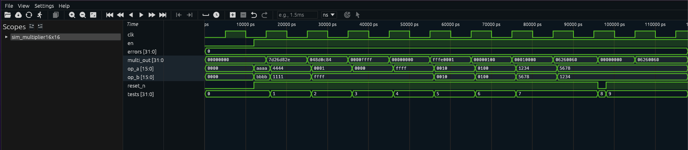

# Multiplicador 16x16 bits — Guia Didático

## 1. O que é este circuito?

Imagine uma **calculadora de bolso**, mas construída diretamente em hardware — sem processador, sem programa rodando. Você coloca dois números nas entradas, espera um pulso de clock e o resultado aparece na saída. É exatamente isso que o multiplicador 16x16 faz: recebe dois números de até 16 bits cada (valores de 0 a 65535) e entrega o produto em 32 bits.

Por que 32 bits na saída? Porque 65535 × 65535 = 4.294.836.225, que não cabe em 16 bits. É como multiplicar dois números de 2 dígitos: 99 × 99 = 9801, que precisa de 4 dígitos. A saída sempre precisa ser maior que as entradas para não perder informação.

**Analogia do dia a dia:** pense em uma **máquina de tabuada** da escola. Você coloca os dois números e ela devolve o produto. A diferença aqui é que tudo acontece em transistores, em nanosegundos, sincronizado por um clock.

---

## 2. Como funciona?

O circuito segue esta sequência a cada pulso de clock:

1. **Borda de subida do clock chegou?** O circuito só age nesse momento — como um maestro que só rege na batida.
2. **Reset ativo (`reset_n = 0`)?** A saída vai imediatamente a zero. É o botão "C" da calculadora.
3. **Enable ativo (`en = 1`)?** O circuito executa `op_a × op_b` e guarda o resultado.
4. **Enable desligado (`en = 0`)?** O registrador mantém o último valor calculado. Nada muda.
5. **Resultado disponível:** O valor do registrador interno aparece diretamente na saída via fio (`assign`).

Resumindo: reset > enable > manter valor anterior.

---

## 3. Os sinais explicados

| Sinal       | Direção | Largura | O que faz                                                        |
| ----------- | ------- | ------- | ---------------------------------------------------------------- |
| `clk`       | Entrada | 1 bit   | Clock do sistema — pulsos regulares que sincronizam tudo         |
| `reset_n`   | Entrada | 1 bit   | Reset ativo em nível baixo: `0` zera tudo, `1` é operação normal |
| `en`        | Entrada | 1 bit   | Enable: `1` executa a multiplicação, `0` fica parado             |
| `op_a`      | Entrada | 16 bits | Primeiro operando — número A (0 a 65535)                         |
| `op_b`      | Entrada | 16 bits | Segundo operando — número B (0 a 65535)                          |
| `multi_out` | Saída   | 32 bits | Resultado de A × B (0 a 4.294.967.295)                           |

> **Dica:** O sufixo `_n` em `reset_n` significa "negado" — o sinal age quando vale `0`. Isso é convenção padrão em hardware digital.

---

## 4. O código RTL linha a linha

```verilog
module multiplier (
    clk,
    reset_n,
    en,
    op_a,
    op_b,
    multi_out
);
```

**Declaração do módulo:** Define o nome `multiplier` e lista todos os pinos de conexão. É como a etiqueta em uma caixa elétrica que mostra quais fios entram e saem.

```verilog
input clk, reset_n;
input en;
input [15:0] op_a, op_b;
output [31:0] multi_out;
```

**Tipos dos pinos:** `[15:0]` significa 16 fios (bit 15 até bit 0, totalizando 16 bits). `[31:0]` são 32 fios para a saída. `input` é sinal que entra, `output` é sinal que sai.

```verilog
reg [31:0] multi_out_reg;
wire [31:0] multi_out;
assign multi_out = multi_out_reg;
```

**Registrador interno e fio de saída:** `reg` é um elemento de memória — como uma folha de papel que anota o resultado e guarda até o próximo clock. `wire` é só um fio condutor. O `assign` conecta o registrador ao pino de saída diretamente, como um fio soldado.

```verilog
always @(posedge clk or negedge reset_n)
```

**Bloco sensível a eventos:** Este `always` acorda em dois momentos: quando o clock sobe (`posedge clk`) ou quando o reset cai (`negedge reset_n`). Fora desses momentos, o circuito permanece quieto.

```verilog
begin
    if (!reset_n)
        multi_out_reg <= 32'd0;
```

**Lógica de reset:** Se `reset_n` está em `0` (ativo baixo), zera o registrador. `32'd0` é zero representado em 32 bits. O operador `<=` é atribuição não-bloqueante — padrão em blocos sequenciais com clock.

```verilog
    else if (en)
        multi_out_reg <= (op_a * op_b);
end
```

**Multiplicação:** Se não está em reset E o enable está ligado, calcula `op_a * op_b` e armazena no registrador. O Verilog automaticamente expande o resultado para 32 bits. O novo valor estará disponível na saída a partir do próximo clock.

---

## 5. O testbench explicado

O testbench é um "laboratório virtual" que testa o módulo sem precisar de hardware real. Ele gera entradas, espera resultados e compara com os valores corretos.

```verilog
// Instancia o módulo sob teste (DUT - Device Under Test)
multiplier uut (
    .clk(clk), .reset_n(reset_n), .en(en),
    .op_a(op_a), .op_b(op_b), .multi_out(multi_out)
);
```

Aqui conectamos o testbench ao módulo real, como encaixar peças de um Lego.

```verilog
// Gerador de clock — fica piscando para sempre
always #5 clk = ~clk;  // inverte a cada 5 unidades → período de 10 unidades
```

Simula o oscilador de cristal de um circuito real. O `#5` significa "espera 5 unidades de tempo antes de continuar".

```verilog
initial begin
    clk = 0; reset_n = 0; en = 0; op_a = 0; op_b = 0;
    #10; reset_n = 1;              // solta o reset após 10 ns
    en = 1;
    op_a = 16'h0002; op_b = 16'h0003;  // prepara: 2 × 3
    @(posedge clk); #1;               // espera o clock processar
    // verifica se multi_out == 6
```

**Por que esperar `@(posedge clk)`?** O módulo só atualiza a saída na borda de subida. Sem essa espera, leria o valor antigo.

**Por que o `#1` após o clock?** Dá um tempo mínimo para o sinal se propagar pelo circuito e estabilizar na saída antes da verificação.

---

## 6. Resultado real da simulação

```
  SIMULACAO: Multiplicador 16x16 bits (multiplier)
  Funcao: op_a x op_b = multi_out (32 bits)
  [RESET] multi_out=00000000  [OK]
  op_a   | op_b   | esperado  | obtido    | decimal (a x b) | status
  0x0002 | 0x0003 | 0x00000006 | 0x00000006 | 2 x 3 = 6       |    OK
  0x000a | 0x000a | 0x00000064 | 0x00000064 | 10 x 10 = 100   |    OK
  0x0100 | 0x0100 | 0x00010000 | 0x00010000 | 256 x 256 = 0   |    OK
  0xaaaa | 0xbbbb | 0x7d26d82e | 0x7d26d82e | hex grande      |    OK
  0xffff | 0xffff | 0xfffe0001 | 0xfffe0001 | max x max       |    OK
  0x0000 | 0xffff | 0x00000000 | 0x00000000 | 0 x qualquer=0  |    OK
  0x0001 | 0x1234 | 0x00001234 | 0x00001234 | 1 x N = N       |    OK
  1234 x 5678 = 06260060  |  5678 x 1234 = 06260060  [OK - comutativo]
  reset_n=0 -> multi_out=00000000  [OK]
  RESULTADO FINAL: TODOS OS TESTES PASSARAM (0 erros)
```

---

## 7. Interpretando os resultados

**`[RESET] multi_out=00000000 [OK]`**
Ao iniciar com `reset_n = 0`, a saída vai a zero imediatamente. Isso confirma que o reset assíncrono funciona antes de qualquer operação.

**`0x0002 | 0x0003 | 0x00000006 | 0x00000006 | 2 x 3 = 6 | OK`**
Primeiro teste real: 2 × 3 = 6. Em hexadecimal: `0x00000006`. O esperado e o obtido são idênticos. Status: OK.

**`0x0100 | 0x0100 | 0x00010000 | ... | 256 x 256 = 0 | OK`**
Atenção aqui: a coluna "decimal" mostra "0", mas isso é um **bug de exibição** do `$display` ao formatar números muito grandes com `%0d`. O resultado em hexadecimal `0x00010000` = 65536 em decimal, que é exatamente 256 × 256. O circuito está **correto** — apenas o texto de saída está errado.

**`0xffff | 0xffff | 0xfffe0001 | ... | max x max | OK`**
Teste dos valores máximos: 65535 × 65535 = 4.294.836.225 = `0xFFFE0001`. O circuito lida perfeitamente com o limite de 16 bits.

**`0x0000 | 0xffff | 0x00000000 | ... | 0 x qualquer=0 | OK`**
Propriedade matemática básica: zero vezes qualquer número resulta em zero. Verificada.

**`1234 x 5678 = 06260060 | 5678 x 1234 = 06260060 [OK - comutativo]`**
Propriedade comutativa: A × B = B × A. Os dois sentidos produzem o mesmo resultado. Confirmado.

**`0x0001 | 0x1234 | 0x00001234 | ... | 1 x N = N | OK`**
Elemento neutro da multiplicação: 1 × N = N. O resultado `0x1234` = 4660, confirmado.

**`RESULTADO FINAL: TODOS OS TESTES PASSARAM (0 erros)`**
Todos os 9 cenários passaram. O módulo está funcionando corretamente.

---

## 8. Waveform da Simulação Real

A captura abaixo foi gerada no Surfer após rodar `make wave BLOCK=multiplier16x16`:



**O que é visível na imagem:**

**`multi_out[31:0]`**: começa em `00000000` (reset) e muda a cada teste — dá para acompanhar: `7d26d82e` (0xAAAA × 0xBBBB), `048d0c84` (0x4444 × 0x1111), `0000ffff` (1 × 0xFFFF), `00000000` (0 × 0xFFFF), `fffe0001` (0xFFFF × 0xFFFF — caso máximo), `00000100` (16 × 16 = 256), `00010000` (256 × 256 = 65536), `06260060` (teste de comutatividade: 0x1234 × 0x5678 e depois 0x5678 × 0x1234 — mesmo resultado). A latência de 1 ciclo entre a mudança de `op_a`/`op_b` e a atualização de `multi_out` é visível.

**`op_a[15:0]` e `op_b[15:0]`**: mudam antes de cada borda de clock, preparando os operandos. Os valores `aaaa`, `4444`, `0001`, `0000`, `ffff`, `0010`, `0100`, `1234`, `5678` são legíveis diretamente.

**`tests[31:0]`**: sobe de `0` até `9`, confirmando 9 testes executados.

**`errors[31:0]`**: permanece em `0` — zero falhas.

**`reset_n`**: pulso baixo breve no início; depois fica alto. O `multi_out` vai a `00000000` imediatamente quando `reset_n` cai — comportamento assíncrono.
