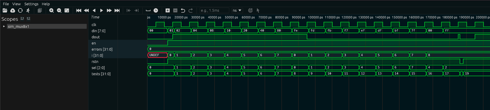

# Multiplexador 8x1 (mux8x1)

## 1. O que é este circuito?

Pense num painel de televisão com 8 câmeras conectadas ao mesmo monitor. Só é possível exibir uma câmera por vez na tela. Você usa um controle remoto com três botões para escolher qual câmera aparece. Isso é exatamente o que o multiplexador faz.

O **multiplexador 8x1** recebe **8 entradas** e seleciona **1 delas** para aparecer na saída. O seletor (`sel`) com 3 bits decide qual das 8 entradas será "encaminhada" para a saída.

O nome "8x1" vem dessa proporção: **8 entradas, 1 saída**.

Outro exemplo: imagine 8 pessoas querendo falar numa reunião, mas só uma pode usar o microfone de cada vez. O multiplexador é o mediador que dá o microfone para quem for selecionado.

O multiplexador é o **inverso do demultiplexador**: enquanto o demux distribui 1 dado para 8 destinos, o mux concentra 8 dados em 1 saída.

---

## 2. Como funciona?

1. O circuito recebe um barramento de 8 bits chamado `din` — são os 8 canais de entrada.
2. Você informa qual canal quer "ouvir" usando 3 bits chamados `sel`. Com 3 bits é possível endereçar 8 canais: 000 a 111.
3. A cada borda de subida do clock, o circuito olha o valor de `sel`, vai até o bit correspondente de `din` e copia esse valor para a saída `dout` (1 bit).
4. Se o reset estiver ativo (rstn = 0), a saída vai imediatamente para zero.
5. Se o enable estiver desligado (en = 0), a saída congela no último valor.

Diferente do demux, aqui a saída é apenas **1 bit** — o valor do canal selecionado.

---

## 3. Os sinais explicados

| Sinal  | Direção | Tamanho | O que significa na prática                                                  |
| ------ | ------- | ------- | --------------------------------------------------------------------------- |
| `clk`  | entrada | 1 bit   | O clock do circuito. A cada borda de subida, a saída é atualizada.          |
| `rstn` | entrada | 1 bit   | Reset ativo baixo: quando vale 0, a saída vai a zero imediatamente.         |
| `en`   | entrada | 1 bit   | Enable: quando vale 1, o circuito funciona; quando vale 0, a saída congela. |
| `din`  | entrada | 8 bits  | Os 8 canais de entrada. Cada bit é um canal independente.                   |
| `sel`  | entrada | 3 bits  | O número do canal que você quer selecionar (0 a 7).                         |
| `dout` | saída   | 1 bit   | O valor do canal selecionado. É sempre 0 ou 1 — apenas um bit.              |

---

## 4. O código RTL linha a linha

```verilog
module mux8x1(
    clk,
    rstn,
    en,
    din,
    sel,
    dout
);
```

Declaração do módulo com todos os seus pinos. Note que a ordem dos pinos na lista não precisa ser a mesma de sua declaração como `input`/`output`.

```verilog
input clk;
input rstn;
input en;
input [7:0] din;
input [2:0] sel;
```

`din` tem 8 bits (`[7:0]`): são os 8 canais de entrada, do bit 0 ao bit 7. `sel` tem 3 bits para endereçar um dos 8 canais.

```verilog
output dout;
```

A saída é apenas **1 bit** — o valor do canal selecionado.

```verilog
wire clk;
wire rstn;
wire en;
wire [7:0] din;
wire [2:0] sel;
reg dout;
```

Todos os sinais de entrada são `wire` (fios). A saída `dout` é `reg` porque precisa guardar seu valor entre um clock e outro.

```verilog
always @(posedge clk or negedge rstn)
begin
```

Bloco sensível à borda de subida do clock e à borda de descida do reset. Tudo que está dentro deste bloco é recalculado quando um desses eventos ocorre.

```verilog
    if (!rstn)
        dout = 0;
```

Reset assíncrono: se rstn = 0, a saída vai imediatamente a zero. O `!rstn` significa "se rstn NÃO estiver em 1", ou seja, se estiver em 0.

```verilog
    else if (en)
        case(sel)
            3'b000: dout = din[0];
            3'b001: dout = din[1];
            3'b010: dout = din[2];
            3'b011: dout = din[3];
            3'b100: dout = din[4];
            3'b101: dout = din[5];
            3'b110: dout = din[6];
            3'b111: dout = din[7];
        endcase
end
```

Aqui está o coração do multiplexador. O `case(sel)` funciona como uma chave seletora:

- Se sel=000, conecta din[0] na saída.
- Se sel=001, conecta din[1] na saída.
- ...e assim por diante até sel=111 conectar din[7].

A escrita é limpa e direta: cada caso tem exatamente uma linha. Compare com o demux, onde cada caso precisava de várias linhas para zerar os outros bits.

```verilog
endmodule
```

Encerra o módulo.

---

## 5. O testbench explicado

**Etapa 1 — Clock:** O TB gera um clock com período de 10ns (borda de subida a cada 5ns). É o "coração" que faz tudo funcionar.

**Etapa 2 — Reset inicial:** Aplica rstn=0 para garantir que o circuito começa em estado limpo, com dout=0.

**Etapa 3 — Testa cada canal com o seu bit em 1:** Para cada valor de sel de 0 a 7, o TB monta um `din` onde **apenas** o bit correspondente a sel está em 1. Por exemplo:

- Para sel=000: din = 00000001 (só o bit 0 é 1)
- Para sel=001: din = 00000010 (só o bit 1 é 1)
- Para sel=010: din = 00000100 (só o bit 2 é 1)
- E assim por diante.

Depois verifica que dout=1. Isso prova que o circuito selecionou exatamente o bit certo.

**Etapa 4 — Testa canal com bit em 0:** Monta um `din` onde todos os bits são 0 e verifica que dout=0, independente do sel. Garante que o circuito não "inventa" valores.

**Etapa 5 — Testa com todos os bits em 1:** Coloca din=11111111 (todos os bits em 1) e sel=101. Verifica que dout=1 — o circuito selecionou o bit 5, que é 1.

**Etapa 6 — Reset no final:** Aplica rstn=0 e confirma que dout volta a zero.

**Etapa 7 — Contagem de erros:** O TB conta cada falha e reporta o resultado final.

---

## 6. Resultado real da simulação

```
  SIMULACAO: Multiplexador 8x1 (mux8x1)
  Funcao: selecionar din[sel] e enviar para dout
  [RESET] rstn=0 -> dout=0  [OK]
  --- Teste: sel escolhe o bit certo de din ---
  sel | din (binario)   | bit[sel] | dout | status
   000 | 00000001       |    1     |  1   |    OK
   001 | 00000010       |    1     |  1   |    OK
   010 | 00000100       |    1     |  1   |    OK
   011 | 00001000       |    1     |  1   |    OK
   100 | 00010000       |    1     |  1   |    OK
   101 | 00100000       |    1     |  1   |    OK
   110 | 01000000       |    1     |  1   |    OK
   111 | 10000000       |    1     |  1   |    OK
  --- Teste: bit selecionado = 0 ---
   sel=000 din[0]=0 -> dout=0  [OK] (para todos sel 0..7)
  sel=101 din=11111111 -> dout=1  [OK]
  rstn=0 -> dout=0  [OK]
  RESULTADO FINAL: TODOS OS TESTES PASSARAM (0 erros)
```

---

## 7. Interpretando os resultados

**`[RESET] rstn=0 -> dout=0 [OK]`**
O circuito começou corretamente com a saída em zero.

**Tabela principal de testes:**

Cada linha desta tabela é um teste cuidadosamente montado. A estratégia é: coloca-se `din` de forma que **apenas** o bit apontado por `sel` valha 1. Se dout=1, o circuito pegou o bit certo.

- `sel=000, din=00000001`: só o bit 0 é 1. dout=1. Correto.
- `sel=001, din=00000010`: só o bit 1 é 1. dout=1. Correto.
- `sel=010, din=00000100`: só o bit 2 é 1. dout=1. Correto.
- O padrão continua: a cada incremento de sel, o único bit ativo em `din` se desloca uma posição para a esquerda, e dout sempre mostra 1.
- `sel=111, din=10000000`: só o bit 7 é 1. dout=1. Correto.

**`sel=000 din[0]=0 -> dout=0 [OK]`**
Quando o bit selecionado vale 0 na entrada, a saída é 0. Confirma que o circuito não "inventa" 1 — ele apenas espelha o que está na entrada.

**`sel=101 din=11111111 -> dout=1 [OK]`**
Com todos os bits da entrada em 1 e sel=101 (canal 5), dout=1. O bit 5 de `11111111` é 1. Correto.

**`rstn=0 -> dout=0 [OK]`**
O reset zera a saída imediatamente, comportamento assíncrono confirmado.

**`RESULTADO FINAL: TODOS OS TESTES PASSARAM (0 erros)`**
O RTL está correto em todos os cenários testados.

---

## 8. Na prática: para que serve e quando usar?

O mux é o **seletor** do mundo digital. Você o usa sempre que tem várias fontes de dado e precisa escolher qual delas vai seguir adiante.

**Onde aparece na vida real:**
- **Debug e monitoramento:** chips com muitos sinais internos usam mux para expor apenas 1 sinal por vez em um pino de teste externo. Você escolhe qual sinal observar pelo valor de `sel` — sem precisar de um pino para cada sinal.
- **Seleção de fonte de clock:** FPGAs e SoCs usam mux para escolher entre clock interno e externo, ou entre frequências diferentes, dependendo do modo de operação.
- **Data path em ALUs:** a Unidade Lógica Aritmética de processadores usa mux para selecionar os operandos corretos antes de cada operação — do registrador A, B, ou de um imediato da instrução.
- **Vídeo:** multiplexadores de pixel escolhem qual fonte de imagem (câmera, memória, gerador de texto) aparece na saída de vídeo.

**Quando escolher um mux:** sempre que a pergunta for *"tenho N sinais e preciso escolher 1 para processar"*. É o inverso do demux, e os dois frequentemente aparecem juntos em sistemas reais.

---

## 9. Waveform da Simulação Real

A captura abaixo foi gerada no Surfer após rodar `make wave BLOCK=8x1mux`:



A simulação tem duas fases bem distintas que você enxerga claramente no waveform.

Na **primeira fase**, `din` exibe o padrão walking-bit (`01 → 02 → 04 → ... → 80`) — a cada ciclo, apenas um bit de `din` está em 1, e é exatamente o bit que `sel` aponta. O resultado é que `dout` fica em 1 o tempo todo. É a prova visual de que o mux está pegando o bit certo em cada canal.

Na **segunda fase**, `din` recebe o padrão complementar (`FE → FD → FB → ... → 7F`) — todos os bits em 1, exceto o que `sel` aponta. `dout` vai para 0 em todos os ciclos. Isso confirma o outro lado da moeda: o mux só entrega o que está no canal selecionado, nada mais.

`sel` incrementa de 0 a 7 sincronizado com as duas fases. O `rstn` aparece como pulso no início, zerando `dout` antes de qualquer teste começar. `errors` permanece em 0 do início ao fim.
