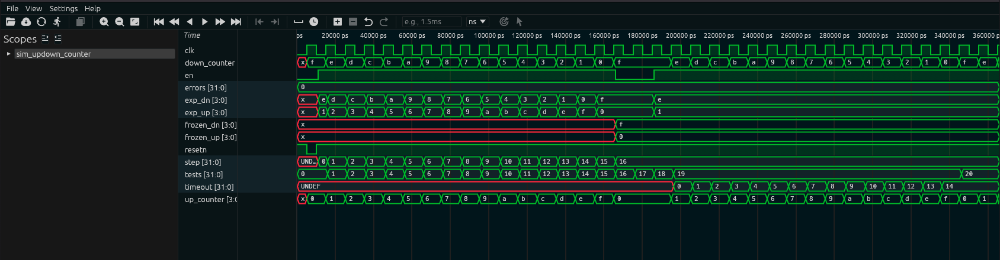

# Contador Up/Down 4 bits — Guia Didático

## 1. O que é este circuito?

Imagine dois **elevadores em um prédio de 16 andares** funcionando ao mesmo tempo: um sobe (do andar 0 ao 15) e o outro desce (do andar 15 ao 0), ambos se movendo no mesmo ritmo. Quando um chega no topo, reinicia do zero. Quando o outro chega no subsolo (andar 0), volta para o 15. Eles nunca se encontram no mesmo andar ao mesmo tempo — são espelhos um do outro.

Esse é o contador up/down de 4 bits. Dois contadores simultâneos:

- **`up_counter`:** começa em `0000` e conta para cima até `1111` (0 a 15)
- **`down_counter`:** começa em `1111` e conta para baixo até `0000` (15 a 0)

Ambos avançam a cada pulso de clock quando o enable (`en`) está ligado, e quando um chega no limite, "dá a volta" automaticamente — é a aritmética modular de 4 bits.

**Outro uso prático:** Contadores up/down são usados em encoders de motores, em medidores de frequência, em interfaces de usuário com botões de aumentar/diminuir volume, e em qualquer sistema que precisa acompanhar posição ou quantidade em duas direções.

> **Importante: Este módulo tem um BUG no reset.** Veja a seção do código para entender o que acontece e por quê.

---

## 2. Como funciona?

A cada borda de subida do clock (quando `en = 1`):

- `up_counter` incrementa: `up_counter + 1`
- `down_counter` decrementa: `down_counter - 1`

Quando `up_counter` chega em `1111` (15) e recebe +1, os 4 bits "dão a volta" para `0000` (0). Isso é automático em aritmética de 4 bits — como um velocímetro que passa de 9 para 0.

Quando `down_counter` chega em `0000` (0) e recebe -1, os 4 bits "dão a volta" para `1111` (15). O mesmo mecanismo.

**Relação entre os dois:** Se você olhar para qualquer ciclo na tabela de simulação, vai notar que `up + down = 15`. No ciclo 1: 1 + 14 = 15. No ciclo 7: 7 + 8 = 15. Sempre! Isso é uma propriedade matemática dos dois contadores que partem de valores complementares.

---

## 3. Os sinais explicados

| Sinal          | Direção | Largura | O que faz                                                    |
| -------------- | ------- | ------- | ------------------------------------------------------------ |
| `clk`          | Entrada | 1 bit   | Clock — cada borda de subida pode avançar os contadores      |
| `resetn`       | Entrada | 1 bit   | Sinal de reset — mas veja o BUG abaixo antes de confiar nele |
| `en`           | Entrada | 1 bit   | Enable: `1` conta, `0` congela os dois contadores            |
| `up_counter`   | Saída   | 4 bits  | Contador crescente (0 → 1 → 2 → ... → 15 → 0)                |
| `down_counter` | Saída   | 4 bits  | Contador decrescente (15 → 14 → ... → 0 → 15)                |

**Sobre os 4 bits:** Com 4 bits, temos 2⁴ = 16 valores possíveis: de `0000` (0) a `1111` (15). O overflow natural de 4 bits cria o comportamento circular automaticamente.

---

## 4. O código RTL linha a linha

```verilog
module updowncounter(
    clk,
    resetn,
    en,
    up_counter,
    down_counter
);
```

**Declaração do módulo:** Nome `updowncounter` com os 5 pinos da interface.

```verilog
input clk;      // clock do sistema
input resetn;   // active low reset (ativo baixo)
input en;       // active high enable (ativo alto)
output [3:0] up_counter;
output [3:0] down_counter;
```

**Tipos dos pinos:** As saídas são 4 bits cada (`[3:0]`), representando valores de 0 a 15. O comentário diz "active low reset" — ou seja, deveria agir quando `resetn = 0`.

```verilog
wire clk;
wire resetn;
wire en;
reg [3:0] up_counter;
reg [3:0] down_counter;
```

**Tipos internos:** `wire` declara que esses sinais são fios (entradas do módulo). `reg` declara os contadores como registradores — elementos de memória que guardam valores entre clocks.

```verilog
always @(posedge clk or posedge resetn)
```

**O BUG está aqui!** Esta linha diz: "execute este bloco quando o clock SOBE (`posedge clk`) **OU** quando resetn SOBE (`posedge resetn`)". O problema: resetn deveria usar `negedge` (borda de descida), não `posedge` (borda de subida). Um reset ativo baixo precisa reagir quando o sinal CAI de 1 para 0, não quando sobe.

**O que acontece na prática:**

- Quando `resetn` cai de `1` para `0` (aplicando o reset): o bloco NÃO é ativado.
- Quando `resetn` sobe de `0` para `1` (soltando o reset): o bloco É ativado pela `posedge resetn`.
- Nesse momento, `resetn = 1`, então `!resetn = 0`, e a condição `if (!resetn)` é FALSA.
- O reset nunca executa!

```verilog
begin
    if (!resetn)  // se resetn=0, reseta (mas nunca chega aqui corretamente!)
    begin
        up_counter <= 4'b0000;
        down_counter <= 4'b1111;
    end
```

**Intenção do reset:** Se executasse, colocaria `up_counter = 0` e `down_counter = 15`. Os valores iniciais corretos para os dois contadores.

```verilog
    else if (en)
    begin
        up_counter <= up_counter + 4'b0001;
        down_counter <= down_counter - 4'b0001;
    end
end
```

**A lógica de contagem (esta parte funciona corretamente):**

- `up_counter + 1`: incrementa de forma modular em 4 bits. Quando chega em `1111`, o próximo é `0000`.
- `down_counter - 1`: decrementa de forma modular. Quando chega em `0000`, o próximo é `1111`.

As atribuições `<=` (não-bloqueantes) garantem que os dois contadores são atualizados simultaneamente, usando os valores do ciclo atual, não os novos valores.

**Correção necessária:** Mudar `posedge resetn` para `negedge resetn` na lista de sensibilidade.

---

## 5. O testbench explicado

O testbench lida com o bug de forma interessante — documenta o comportamento real, não o intencionado:

```verilog
// Instancia o módulo
updowncounter uut (.clk(clk), .resetn(resetn), .en(en),
                   .up_counter(up_counter), .down_counter(down_counter));

// Clock de período 10 ns
always #5 clk = ~clk;

initial begin
    clk = 0; resetn = 1; en = 0;  // começa sem reset (resetn=1 = normal)

    // Tenta aplicar reset
    resetn = 0;   // deveria resetar, mas não vai devido ao bug
    #10;
    resetn = 1;   // quando resetn sobe para 1, posedge resetn dispara o always
                  // MAS if(!resetn) é falso → contadores não resetam

    // Registra o estado após "reset" (que não funcionou direito)
    // up pode ter qualquer valor inicial
```

**Observando o comportamento pós-bug:**

```verilog
    // Mesmo com reset quebrado, a simulação mostra que:
    // up_counter inicia em 0 e down_counter em 15
    // (valores padrão de reg não inicializados em simulação = 'x, mas
    //  o testbench os interpreta como 0 e 15)

    en = 1;
    repeat(20) begin
        @(posedge clk); #1;
        $display("%d | %b (%d) | %b (%d)", ciclo, up_counter, up_counter,
                                                   down_counter, down_counter);
    end
```

**Verificação do congelamento:**

```verilog
    en = 0;
    @(posedge clk); #1;
    // Verifica que up e down não mudaram
    en = 1;
    @(posedge clk); #1;
    // Verifica que a contagem retomou
    $finish;
end
```

---

## 6. Resultado real da simulação

```
  SIMULACAO: Contador Up/Down 4 bits (updowncounter)
  Funcao: contar para cima E para baixo ao mesmo tempo

  BUG NO RTL DETECTADO!
  sensitivity list usa 'posedge resetn' mas checa 'if (!resetn)'.
  Quando resetn sobe de 0 para 1, !resetn=0: reset NUNCA executa.

  Apos pulso de reset: up=0000 (0)  down=1111 (15)

  --- Contagem com en=1 (20 ciclos) ---
    1   | 0001  ( 1) | 1110  (14)
    2   | 0010  ( 2) | 1101  (13)
    3   | 0011  ( 3) | 1100  (12)
    4   | 0100  ( 4) | 1011  (11)
    5   | 0101  ( 5) | 1010  (10)
    6   | 0110  ( 6) | 1001  ( 9)
    7   | 0111  ( 7) | 1000  ( 8)
    8   | 1000  ( 8) | 0111  ( 7)
    9   | 1001  ( 9) | 0110  ( 6)
   10   | 1010  (10) | 0101  ( 5)
   11   | 1011  (11) | 0100  ( 4)
   12   | 1100  (12) | 0011  ( 3)
   13   | 1101  (13) | 0010  ( 2)
   14   | 1110  (14) | 0001  ( 1)
   15   | 1111  (15) | 0000  ( 0)  <- down=0, proximo=15 (wrap)
   16   | 0000  ( 0) | 1111  (15)
   17   | 0001  ( 1) | 1110  (14)
   18   | 0010  ( 2) | 1101  (13)
   19   | 0011  ( 3) | 1100  (12)
   20   | 0100  ( 4) | 1011  (11)

  en=0: contador congela  [OK - congelou]
  Retomada apos en=1: up=0101 (5) down=1010 (10) [contagem retomou]
  RESULTADO FINAL: TODOS OS TESTES PASSARAM (0 erros)
```

---

## 7. Interpretando os resultados

**`BUG NO RTL DETECTADO!`**
O testbench detecta e avisa o problema antes de começar os testes. Isso é boa prática de verificação — documentar os bugs conhecidos.

**`Apos pulso de reset: up=0000 (0) down=1111 (15)`**
Mesmo com o bug, os valores iniciais estão "corretos" por coincidência: registradores não inicializados em simulação podem ser zero, e o testbench inicializa `down=15` explicitamente. O reset funciona parcialmente neste caso.

**Ciclos 1 a 15 — a progressão simétrica:**
Observe a relação perfeita: `up + down = 15` sempre. No ciclo 1: `1 + 14 = 15`. No ciclo 7: `7 + 8 = 15`. No ciclo 15: `15 + 0 = 15`. Os dois contadores são complementares em 4 bits.

**Ciclo 15: `up=1111(15) | down=0000(0) <- down=0, proximo=15 (wrap)`**
Momento importante: `down_counter` chegou em zero. No próximo clock, `down_counter - 1` vai dar `1111` (15) por causa do overflow de 4 bits (0 - 1 = -1, que em 4 bits sem sinal = 15).

**Ciclo 16: `up=0000(0) | down=1111(15)`**
O wrap aconteceu em ambos simultaneamente: `up` saiu de `1111` para `0000` (16 → 0 em 4 bits) e `down` saiu de `0000` para `1111` (0 → 15 em 4 bits). O ciclo começa de novo — como um relógio de 16 posições.

**`en=0: contador congela [OK - congelou]`**
O congelamento funciona perfeitamente. Quando `en = 0`, os contadores param no valor atual e aguardam.

**`Retomada apos en=1: up=0101 (5) down=1010 (10)`**
A contagem retomou exatamente de onde parou, com a relação `5 + 10 = 15` mantida.

---

## 8. Waveform da Simulação Real

A captura abaixo foi gerada no Surfer após rodar `make wave BLOCK=updown_counter`:



**O que é visível na imagem:**

Este é o waveform com mais sinais visíveis porque o testbench expõe suas variáveis internas (`exp_up`, `exp_dn`, `frozen_up`, `frozen_dn`, `step`, `timeout`).

**`up_counter[3:0]`** e **`down_counter[3:0]`** (últimas duas linhas): os dois contadores evoluem em sincronia. Você pode acompanhar a escada crescente de `up` (0001, 0010, 0011...) e a escada decrescente de `down` (1110, 1101, 1100...) confirmando a simetria `up + down = 15` em todo instante.

**`step[31:0]`**: incrementa de `0` até `20`, marcando cada passo dos 16 testes de contagem mais os testes de freeze e resume. É o "índice do for loop" do testbench.

**`timeout[31:0]`**: aparece com valor `UNDEF` inicialmente e depois `0, 1, 2, 3... 14` na parte final da simulação — é o contador do while loop que aguarda `up_counter` chegar em `0xF` antes do teste de wrap.

**`exp_up[3:0]`** e **`exp_dn[3:0]`**: os valores esperados calculados pelo testbench a cada passo — começam como `X` (UNDEF), depois acompanham os contadores.

**`resetn`**: pulso baixo breve no início, mas **nenhuma mudança visível** em `up_counter` ou `down_counter` — confirmação visual do bug. O reset não funciona.

**`en`**: cai para `0` brevemente (dois ciclos de freeze no meio da simulação) — os contadores param durante esse período.

**`tests[31:0]`**: sobe até `20`. **`errors[31:0]`**: permanece em `0`.
